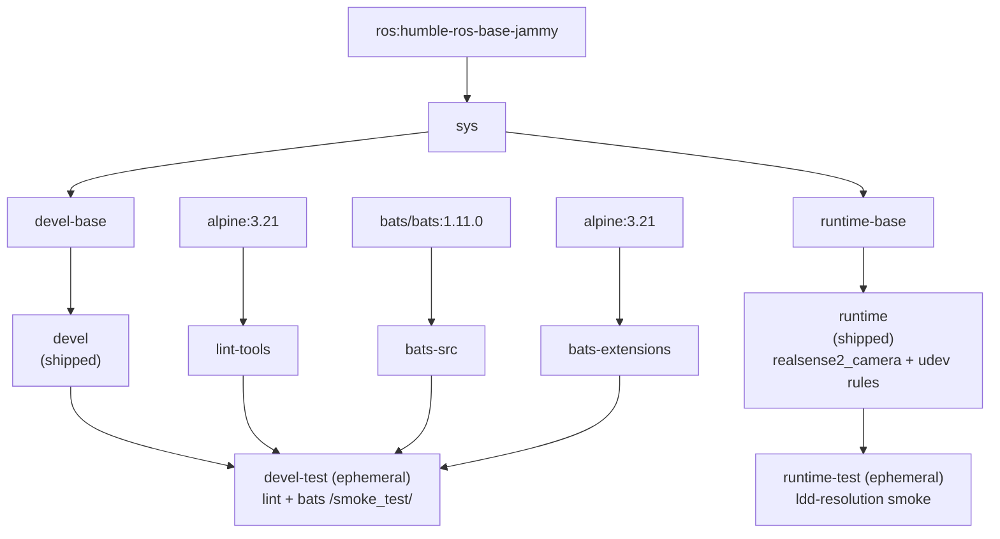

# Intel RealSense Docker Container (ROS 2)

[](https://github.com/ycpss91255-docker/realsense_ros2/actions/workflows/main.yaml) [](./LICENSE)

**[English](README.md)** | **[繁體中文](doc/README.zh-TW.md)** | **[简体中文](doc/README.zh-CN.md)** | **[日本語](doc/README.ja.md)**

## TL;DR

Containerized Intel RealSense driver for ROS 2. Installs `realsense2-camera` and `realsense2-description` from apt (which pull in `librealsense2` transitively), includes udev rules for device access.

```bash
just build && just run
```

---

## Table of Contents

- [Overview](#overview)
- [Features](#features)
- [Quick Start](#quick-start)
- [Usage](#usage)
- [Configuration](#configuration)
- [Architecture](#architecture)
- [Smoke Tests](#smoke-tests)
- [Directory Structure](#directory-structure)

---

## Overview

Provides a reproducible ROS 2 environment for Intel RealSense depth cameras. The container installs the `ros-humble-realsense2-camera` and `ros-humble-realsense2-description` packages from the ROS 2 apt repository (the `librealsense2` libraries come in transitively as their dependency) and ships with the upstream udev rules baked in so USB devices come up under the correct permissions inside the container. Multi-arch base image supports x86_64 and ARM64 (Raspberry Pi, Jetson CPU mode).

## Features

- **Apt-based install**: `realsense2-camera` and `realsense2-description` from ROS 2 apt repository (`librealsense2` pulled in transitively)
- **Smoke Test**: Bats tests run automatically during build to verify environment
- **Docker Compose**: single `compose.yaml` manages all targets
- **udev rules**: Pre-configured for RealSense USB device access
- **Multi-arch**: Supports x86_64 and ARM64 (RPi, Jetson CPU mode)

## Quick Start

```bash
# 1. Build
just build

# 2. Run (default: ros2 launch realsense2_camera rs_launch.py)
just run

# Or use docker compose directly
docker compose up runtime
docker compose down
```

## Usage

### Runtime

The user entry point is `just` (the repo-root `justfile` symlinks into the base
subtree). Recipes forward 1:1 to the wrapper scripts under `script/` with full
argument passthrough -- no `--` separator needed.

```bash
just build                       # Build (default: devel)
just build test                  # Build the devel-test gate
just run                         # Start (e.g. just run -d)
just exec                        # Enter running container
just stop                        # Stop and remove containers
just setup                       # Regenerate .env + compose.yaml from setup.conf

docker compose build runtime     # Equivalent low-level command
docker compose up runtime        # Start
docker compose exec runtime bash # Enter running container
```

### Smoke tests (test stages)

Smoke tests run automatically during build; the build fails if tests fail. The
`devel-test` stage runs lint (ShellCheck + Hadolint) plus the bats suite, and
the `runtime-test` stage runs an ldd-resolution check over the installed
`realsense2_camera` libraries.

```bash
just build test
# or
docker compose --profile test build test
```

## Configuration

### Configuration surface (setup.conf)

The real configuration surface is `config/docker/setup.conf`. `just setup`
generates `.env` and `compose.yaml` from it, so `.env` is a generated artifact
and should not be hand-edited. Edit `setup.conf` (or `just setup-tui`) and
re-run `just setup`.

`setup.conf` is organised into sections -- `[image]`, `[build]`, `[deploy]`,
`[gui]`, `[network]`, `[security]`, `[resources]`, `[environment]`, `[tmpfs]`,
`[devices]`, `[volumes]`. For example, the `[deploy]` section carries the GPU
runtime keys (`gpu_mode`, `gpu_count`, `gpu_capabilities`, `gpu_runtime`), and
`[image]` derives the image name from naming rules rather than a literal
`image_name` key.

### RealSense udev Rules

The udev rules must be installed on the **host**, not just inside the container.
The container has no `udevd`, and a device node's permissions live on the host
`devtmpfs` inode shared through the `/dev` bind mount, so the in-image copy of
the rules does nothing on its own. Without the host rules the non-root container
user cannot open the raw USB node and the SDK misdetects the camera (reports USB
2.0, `Product Line not supported`, or fails firmware updates). See
[IntelRealSense/librealsense#12022](https://github.com/IntelRealSense/librealsense/issues/12022).

Install them once on the host with the bundled script (uses `sudo`):

```bash
./script/install_udev_rules.sh
```

It copies `config/realsense/99-realsense-libusb.rules` to `/etc/udev/rules.d/`
and reloads udev. Re-plug the camera afterwards. The container itself runs in
`privileged` mode with `/dev` mounted.

## Architecture

### Docker Build Stage Diagram



### Stage Description

| Stage | FROM | Purpose |
|-------|------|---------|
| `bats-src` | `bats/bats:1.11.0` | Bats binary source, not shipped |
| `bats-extensions` | `alpine:3.21` | bats-support, bats-assert, not shipped |
| `lint-tools` | `alpine:3.21` | ShellCheck + Hadolint, not shipped |
| `sys` | `ros:humble-ros-base-jammy` | Common base: user, locale, timezone (base v0.41.0 build contract) |
| `devel-base` | `sys` | Dev tools + RealSense packages + Dynamic Calibration Tool (amd64) |
| `devel` | `devel-base` | Shipped dev image (default CMD `bash`) |
| `devel-test` | `devel` | Lint + smoke tests, discarded after build (ephemeral) |
| `runtime-base` | `sys` | Minimal base (`sudo`, `tini`) |
| `runtime` | `runtime-base` | Shipped runtime image: RealSense packages + udev rules (default CMD `ros2 launch realsense2_camera rs_launch.py`) |
| `runtime-test` | `runtime` | ldd-resolution smoke over `realsense2_camera` libs, discarded after build (ephemeral) |

## Smoke Tests

See [TEST.md](doc/test/TEST.md) for the automatic build-time tests, and
[CAMERA.md](doc/CAMERA.md) for testing with a physical camera, and
[CALIBRATION.md](doc/CALIBRATION.md) for the Dynamic Calibration Tool.

## Directory Structure

```text
realsense_ros2/
├── Dockerfile                   # Multi-stage build
├── LICENSE
├── README.md
├── justfile -> .base/script/docker/justfile        # symlink (user entry point)
├── .hadolint.yaml -> .base/.hadolint.yaml          # symlink
├── .base/                       # base subtree (read-only; v0.41.0)
├── script/
│   ├── entrypoint.sh            # Container entrypoint (repo-owned)
│   ├── install_udev_rules.sh    # Install RealSense udev rules on the host (repo-owned)
│   ├── build.sh -> ../.base/script/docker/wrapper/build.sh   # symlink
│   ├── run.sh   -> ../.base/script/docker/wrapper/run.sh     # symlink
│   ├── exec.sh  -> ../.base/script/docker/wrapper/exec.sh    # symlink
│   ├── stop.sh  -> ../.base/script/docker/wrapper/stop.sh    # symlink
│   ├── prune.sh -> ../.base/script/docker/wrapper/prune.sh   # symlink
│   ├── setup.sh -> ../.base/script/docker/wrapper/setup.sh   # symlink
│   ├── setup_tui.sh -> ../.base/script/docker/wrapper/setup_tui.sh  # symlink
│   └── hooks/                   # pre/ + post/ wrapper hooks
├── config/
│   ├── docker/
│   │   └── setup.conf           # configuration surface (.env/compose.yaml generated from this)
│   └── realsense/
│       └── 99-realsense-libusb.rules  # RealSense udev rules
├── doc/
│   ├── README.zh-TW.md          # Traditional Chinese
│   ├── README.zh-CN.md          # Simplified Chinese
│   ├── README.ja.md             # Japanese
│   ├── CAMERA.md               # manual testing with a physical camera
│   ├── CALIBRATION.md          # Dynamic Calibration Tool guide
│   ├── changelog/CHANGELOG.md
│   └── test/
│       └── TEST.md             # automatic build-time smoke tests
├── .github/workflows/
│   └── main.yaml                # CI (calls base reusable build/release workers)
└── test/
    └── smoke/                   # repo-owned bats tests
        └── ros_env.bats         # (helper + more .bats come from .base/test/smoke/)
```
