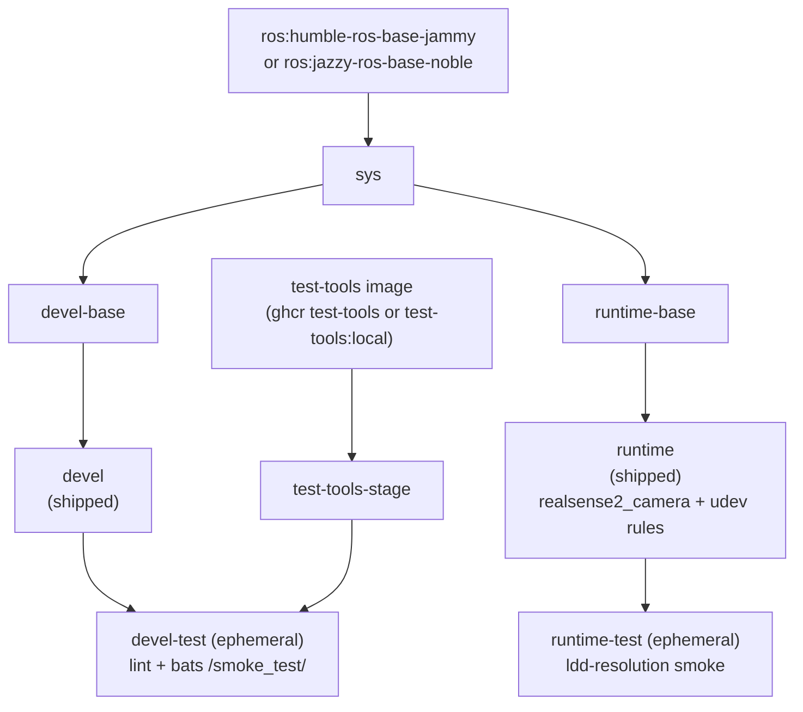

# Intel RealSense Docker Container (ROS 2)

[](https://github.com/ycpss91255-docker/realsense_ros2/actions/workflows/main.yaml) [](./LICENSE)

**[English](README.md)** | **[繁體中文](doc/README.zh-TW.md)** | **[简体中文](doc/README.zh-CN.md)** | **[日本語](doc/README.ja.md)**

## TL;DR

An Intel RealSense camera **as a containerized ROS 2 app**: the `runtime` image's default command launches the camera node and publishes live **RGB + depth** topics. Installs `realsense2-camera` / `realsense2-description` from apt (pulling in `librealsense2`) and ships the udev rules for USB access. Multi-distro (Humble + Jazzy), multi-arch (x86_64 + ARM64 / Raspberry Pi).

```bash
./script/install_udev_rules.sh      # once on the host (physical camera)
just build && just run -t runtime    # build + launch the camera app
# -> logs show "RealSense Node Is Up!" and depth/color streaming
```

> `just run` on its own opens the **devel** dev shell, not the camera app -- use `just run -t runtime`. See [Quick Start](#quick-start) to view the RGB-D streams.

---

## Table of Contents

- [Overview](#overview)
- [Features](#features)
- [Prerequisites](#prerequisites)
- [Quick Start](#quick-start)
- [Usage](#usage)
- [Uninstall / Cleanup](#uninstall--cleanup)
- [Configuration](#configuration)
- [Architecture](#architecture)
- [Smoke Tests](#smoke-tests)
- [Directory Structure](#directory-structure)

---

## Overview

Provides a reproducible ROS 2 environment for Intel RealSense depth cameras. CI builds the image for **both ROS 2 Humble (Ubuntu 22.04) and Jazzy (Ubuntu 24.04)**; each installs the matching `ros-<distro>-realsense2-camera` and `ros-<distro>-realsense2-description` packages from the ROS 2 apt repository (the `librealsense2` libraries come in transitively as their dependency) and ships with the upstream udev rules baked in so USB devices come up under the correct permissions inside the container. The multi-arch base image supports x86_64 and ARM64 (Raspberry Pi, Jetson CPU mode).

## Features

- **Multi-distro**: CI builds ROS 2 Humble (Ubuntu 22.04) and Jazzy (Ubuntu 24.04) from one Dockerfile
- **Apt-based install**: `realsense2-camera` and `realsense2-description` from ROS 2 apt repository (`librealsense2` pulled in transitively)
- **Smoke Test**: Bats tests run automatically during build to verify environment
- **Docker Compose**: single `compose.yaml` manages all targets
- **udev rules**: Pre-configured for RealSense USB device access
- **Multi-arch**: Supports x86_64 and ARM64 (RPi, Jetson CPU mode)

## Prerequisites

The user entry point is `just`, which drives Docker. Install these on the host once:

- **Docker Engine + Compose plugin.** The wrappers call `docker compose`, so the
  Compose plugin must be present. The official convenience script installs Engine +
  Buildx + Compose together:

  ```bash
  curl -fsSL https://get.docker.com | sudo sh
  sudo usermod -aG docker "$USER"   # log out/in so docker runs without sudo
  ```

  Verify with `docker compose version`. (Distro packages alone may omit Compose --
  e.g. `docker.io` without `docker-compose-v2` yields `docker: unknown command:
  docker compose`.)

- **just** (command runner). Prebuilt binary into `~/.local/bin`, no sudo:

  ```bash
  curl --proto '=https' --tlsv1.2 -sSf https://just.systems/install.sh | bash -s -- --to ~/.local/bin
  ```

  Ensure `~/.local/bin` is on `PATH`, then verify with `just --version`. Every recipe
  also has a raw fallback (`./script/<verb>.sh`) if you prefer not to install `just`.

- **(Physical camera) host udev rules.** To use a real RealSense over USB, install
  the bundled rules on the host (see [RealSense udev Rules](#realsense-udev-rules)):

  ```bash
  ./script/install_udev_rules.sh
  ```

  Without them the non-root container user cannot open the raw USB node and the SDK
  misdetects the camera -- e.g. a USB 3 device enumerating as USB 2.1 ("Reduced
  performance expected").

## Quick Start

```bash
# 1. Build (default: ROS 2 Humble)
just build

# 2. (physical camera) install the host udev rules once
./script/install_udev_rules.sh

# 3. Launch the camera app. The `runtime` service's default command is
#    `ros2 launch realsense2_camera rs_launch.py`; foreground shows the node logs:
just run -t runtime
#    ...or detached:
just run -d -t runtime
```

> Use-only deployment (e.g. a Raspberry Pi that just runs the camera) can skip
> step 1: `just build` builds the **devel** image (ros-desktop, rviz, rqt --
> 4GB+) for development. `just run -t runtime` auto-builds the minimal runtime
> image on first use, so the camera app needs no prior `just build`.

### See the RGB-D data

**CLI** -- confirm the colour + depth topics are streaming (interactive exec has `ros2`):

```bash
just exec -t runtime bash -ic 'ros2 topic hz /camera/camera/color/image_raw'
just exec -t runtime bash -ic 'ros2 topic hz /camera/camera/depth/image_rect_raw'
```

**Visual** -- view the image streams with `rqt` (the `devel` image ships `rqt_image_view`):

```bash
just run -t devel
# inside the container:
ros2 launch realsense2_camera rs_launch.py &     # start the camera
ros2 run rqt_image_view rqt_image_view           # pick color/image_raw and depth/image_rect_raw
```

> `just run` with no `-t` opens the **devel** dev shell, not the camera app -- use
> `just run -t runtime` for the app. Adjust the camera by passing launch args, e.g.
> `just run -t runtime ros2 launch realsense2_camera rs_launch.py pointcloud.enable:=true`,
> or override the command entirely. Low-level equivalents are in [Usage](#usage).

## Usage

### Runtime

The user entry point is `just` (the repo-root `justfile` symlinks into the base
subtree). Recipes forward 1:1 to the wrapper scripts under `script/` with full
argument passthrough -- no `--` separator needed.

```bash
just build                       # Build (default: devel)
just build test                  # Build the devel-test gate
just run                         # Start (e.g. just run -d)
just exec                        # Enter running container
just stop                        # Stop and remove containers
just setup                       # Regenerate .env + compose.yaml from setup.conf

docker compose build runtime     # Equivalent low-level command
docker compose up runtime        # Start
docker compose exec runtime bash # Enter running container
```

### Selecting a ROS 2 distro

`just build` uses the Dockerfile defaults (Humble / Ubuntu 22.04 jammy). CI
builds both Humble and Jazzy automatically via the `call-docker-build` matrix in
`.github/workflows/main.yaml`. To build Jazzy locally, pass the matching build
args through `docker compose`:

```bash
docker compose build \
  --build-arg ROS_DISTRO=jazzy \
  --build-arg ROS_TAG=ros-base \
  --build-arg UBUNTU_CODENAME=noble \
  runtime
```

### Smoke tests (test stages)

Smoke tests run automatically during build; the build fails if tests fail. The
`devel-test` stage runs lint (ShellCheck + Hadolint) plus the bats suite, and
the `runtime-test` stage runs an ldd-resolution check over the installed
`realsense2_camera` libraries.

```bash
just build test
# or
docker compose --profile test build test
```

## Uninstall / Cleanup

```bash
just stop      # stop and remove the running containers
just prune     # remove this repo's images + dangling build cache (see `just prune -h`)
```

To fully remove what the repo placed on the host:

- **Images / build cache:** `just prune` (or `docker image rm <tag>` for a specific image).
- **Host udev rules** (only if you installed them):

  ```bash
  sudo rm -f /etc/udev/rules.d/99-realsense-libusb.rules
  sudo udevadm control --reload-rules && sudo udevadm trigger
  ```

- **The repo:** delete the cloned directory.

## Configuration

### Configuration surface (setup.conf)

The real configuration surface is `config/docker/setup.conf`. `just setup`
generates `.env` and `compose.yaml` from it, so `.env` is a generated artifact
and should not be hand-edited. Edit `setup.conf` (or `just setup-tui`) and
re-run `just setup`.

`setup.conf` is organised into sections -- `[image]`, `[build]`, `[deploy]`,
`[gui]`, `[network]`, `[security]`, `[resources]`, `[environment]`, `[tmpfs]`,
`[devices]`, `[volumes]`. For example, the `[deploy]` section carries the GPU
runtime keys (`gpu_mode`, `gpu_count`, `gpu_capabilities`, `gpu_runtime`), and
`[image]` derives the image name from naming rules rather than a literal
`image_name` key.

### RealSense udev Rules

The udev rules must be installed on the **host**, not just inside the container.
The container has no `udevd`, and a device node's permissions live on the host
`devtmpfs` inode shared through the `/dev` bind mount, so the in-image copy of
the rules does nothing on its own. Without the host rules the non-root container
user cannot open the raw USB node and the SDK misdetects the camera (reports USB
2.0, `Product Line not supported`, or fails firmware updates). See
[IntelRealSense/librealsense#12022](https://github.com/IntelRealSense/librealsense/issues/12022).

Install them once on the host with the bundled script (uses `sudo`):

```bash
./script/install_udev_rules.sh
```

It copies `config/realsense/99-realsense-libusb.rules` to `/etc/udev/rules.d/`
and reloads udev. Re-plug the camera afterwards. The container itself runs in
`privileged` mode with `/dev` mounted.

## Architecture

### Docker Build Stage Diagram



### Stage Description

| Stage | FROM | Purpose |
|-------|------|---------|
| `test-tools-stage` | `${TEST_TOOLS_IMAGE}` (multi-arch ghcr test-tools, or `test-tools:local`) | ShellCheck + Hadolint + Bats, not shipped |
| `sys` | `ros:<distro>-ros-base-<codename>` (humble-jammy / jazzy-noble) | Common base: user, locale, timezone (base v0.41.0 build contract) |
| `devel-base` | `sys` | Dev tools + ROS 2 desktop + RealSense packages + Dynamic Calibration Tool (amd64) |
| `devel` | `devel-base` | Shipped dev image (default CMD `bash`) |
| `devel-test` | `devel` + `test-tools-stage` | Lint + smoke tests, discarded after build (ephemeral) |
| `runtime-base` | `sys` | Minimal base (`sudo`, `tini`) |
| `runtime` | `runtime-base` | Shipped runtime image: RealSense packages + udev rules (default CMD `ros2 launch realsense2_camera rs_launch.py`) |
| `runtime-test` | `runtime` | ldd-resolution smoke over `realsense2_camera` libs, discarded after build (ephemeral) |

## Smoke Tests

See [TEST.md](doc/test/TEST.md) for the automatic build-time tests, and
[CAMERA.md](doc/CAMERA.md) for testing with a physical camera, and
[CALIBRATION.md](doc/CALIBRATION.md) for the Dynamic Calibration Tool.

## Directory Structure

```text
realsense_ros2/
├── Dockerfile                   # Multi-stage build
├── LICENSE
├── README.md
├── justfile -> .base/script/docker/justfile        # symlink (user entry point)
├── .hadolint.yaml -> .base/.hadolint.yaml          # symlink
├── .base/                       # base subtree (read-only; v0.41.0)
├── script/
│   ├── entrypoint.sh            # Container entrypoint (repo-owned)
│   ├── install_udev_rules.sh    # Install RealSense udev rules on the host (repo-owned)
│   ├── build.sh -> ../.base/script/docker/wrapper/build.sh   # symlink
│   ├── run.sh   -> ../.base/script/docker/wrapper/run.sh     # symlink
│   ├── exec.sh  -> ../.base/script/docker/wrapper/exec.sh    # symlink
│   ├── stop.sh  -> ../.base/script/docker/wrapper/stop.sh    # symlink
│   ├── prune.sh -> ../.base/script/docker/wrapper/prune.sh   # symlink
│   ├── setup.sh -> ../.base/script/docker/wrapper/setup.sh   # symlink
│   ├── setup_tui.sh -> ../.base/script/docker/wrapper/setup_tui.sh  # symlink
│   └── hooks/                   # pre/ + post/ wrapper hooks
├── config/
│   ├── docker/
│   │   └── setup.conf           # configuration surface (.env/compose.yaml generated from this)
│   └── realsense/
│       └── 99-realsense-libusb.rules  # RealSense udev rules
├── doc/
│   ├── README.zh-TW.md          # Traditional Chinese
│   ├── README.zh-CN.md          # Simplified Chinese
│   ├── README.ja.md             # Japanese
│   ├── adr/                     # Architecture Decision Records
│   ├── CAMERA.md               # manual testing with a physical camera
│   ├── CALIBRATION.md          # Dynamic Calibration Tool guide
│   ├── changelog/CHANGELOG.md
│   └── test/
│       └── TEST.md             # automatic build-time smoke tests
├── .github/workflows/
│   └── main.yaml                # CI (calls base reusable build/release workers)
└── test/
    └── smoke/                   # repo-owned bats tests
        └── ros_env.bats         # (helper + more .bats come from .base/test/smoke/)
```
