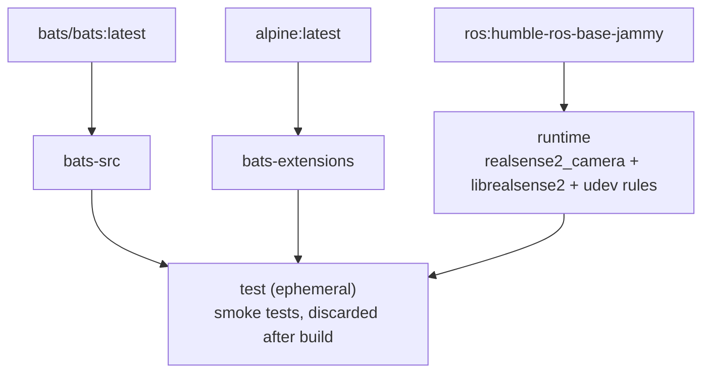

# Intel RealSense Docker Container (ROS 2)

[](https://github.com/ycpss91255-docker/realsense_ros2/actions/workflows/main.yaml) [](./LICENSE)

[](https://github.com/ycpss91255-docker/realsense_ros2/actions/workflows/main.yaml)

**[English](README.md)** | **[繁體中文](doc/README.zh-TW.md)** | **[简体中文](doc/README.zh-CN.md)** | **[日本語](doc/README.ja.md)**

## TL;DR

Containerized Intel RealSense driver for ROS 2. Installs `realsense2_camera` and `librealsense2` from apt, includes udev rules for device access.

```bash
./build.sh && ./run.sh
```

---

## Table of Contents

- [Overview](#overview)
- [Features](#features)
- [Quick Start](#quick-start)
- [Usage](#usage)
- [Configuration](#configuration)
- [Architecture](#architecture)
- [Smoke Tests](#smoke-tests)
- [Directory Structure](#directory-structure)

---

## Overview

Provides a reproducible ROS 2 environment for Intel RealSense depth cameras. The container installs `realsense2_camera` and `librealsense2` from the ROS 2 apt repository and ships with the upstream udev rules baked in so USB devices come up under the correct permissions inside the container. Multi-arch base image supports x86_64 and ARM64 (Raspberry Pi, Jetson CPU mode).

## Features

- **Apt-based install**: `realsense2_camera` and `librealsense2` from ROS 2 apt repository
- **Smoke Test**: Bats tests run automatically during build to verify environment
- **Docker Compose**: single `compose.yaml` manages all targets
- **udev rules**: Pre-configured for RealSense USB device access
- **Multi-arch**: Supports x86_64 and ARM64 (RPi, Jetson CPU mode)

## Quick Start

```bash
# 1. Build
./build.sh

# 2. Run (default: realsense2_camera rs_launch.py)
./run.sh

# Or use docker compose directly
docker compose up runtime
docker compose down
```

## Usage

### Runtime

```bash
./build.sh                       # Build (default: runtime)
./build.sh --no-env test         # Build without refreshing .env
./run.sh                         # Start (default: runtime)
./exec.sh                        # Enter running container
./stop.sh                        # Stop and remove containers

docker compose build runtime     # Equivalent command
docker compose up runtime        # Start
docker compose exec runtime bash # Enter running container
```

### Testing (test)

Smoke tests run automatically during build; build fails if tests fail.

```bash
./build.sh test
# or
docker compose --profile test build test
```

## Configuration

### .env Parameters

| Variable | Description | Example |
|----------|-------------|---------|
| `DOCKER_HUB_USER` | Docker Hub username | `myuser` |
| `IMAGE_NAME` | Image name | `realsense_ros2` |

### RealSense udev Rules

The container includes udev rules at `/etc/udev/rules.d/99-realsense-libusb.rules` for RealSense USB device access. The container runs in `privileged` mode with `/dev` mounted.

## Architecture

### Docker Build Stage Diagram



### Stage Description

| Stage | FROM | Purpose |
|-------|------|---------|
| `bats-src` | `bats/bats:latest` | Bats binary source, not shipped |
| `bats-extensions` | `alpine:latest` | bats-support, bats-assert, not shipped |
| `lint-tools` | `alpine:latest` | ShellCheck + Hadolint, not shipped |
| `runtime` | `ros:humble-ros-base-jammy` | RealSense packages + udev rules |
| `test` | `runtime` | Lints + smoke tests, discarded after build |

## Smoke Tests

See [TEST.md](doc/test/TEST.md) for details.

## Directory Structure

```text
realsense_ros2/
├── compose.yaml                 # Docker Compose definition
├── Dockerfile                   # Multi-stage build
├── build.sh                     # Build script
├── run.sh                       # Run script
├── exec.sh                      # Enter running container
├── stop.sh                      # Stop and remove containers
├── .hadolint.yaml               # Hadolint ignore rules
├── script/
│   └── entrypoint.sh            # Container entrypoint
├── config/
│   └── realsense/
│       └── 99-realsense-libusb.rules  # RealSense udev rules
├── doc/
│   ├── README.zh-TW.md          # Traditional Chinese
│   ├── README.zh-CN.md          # Simplified Chinese
│   └── README.ja.md             # Japanese
├── .github/workflows/           # CI/CD
│   ├── main.yaml                # Main pipeline
│   ├── build-worker.yaml        # Docker build + smoke test
│   └── release-worker.yaml      # GitHub Release
└── test/
    └── smoke/              # Bats environment tests
        ├── ros_env.bats
        ├── script_help.bats
        └── test_helper.bash
```
