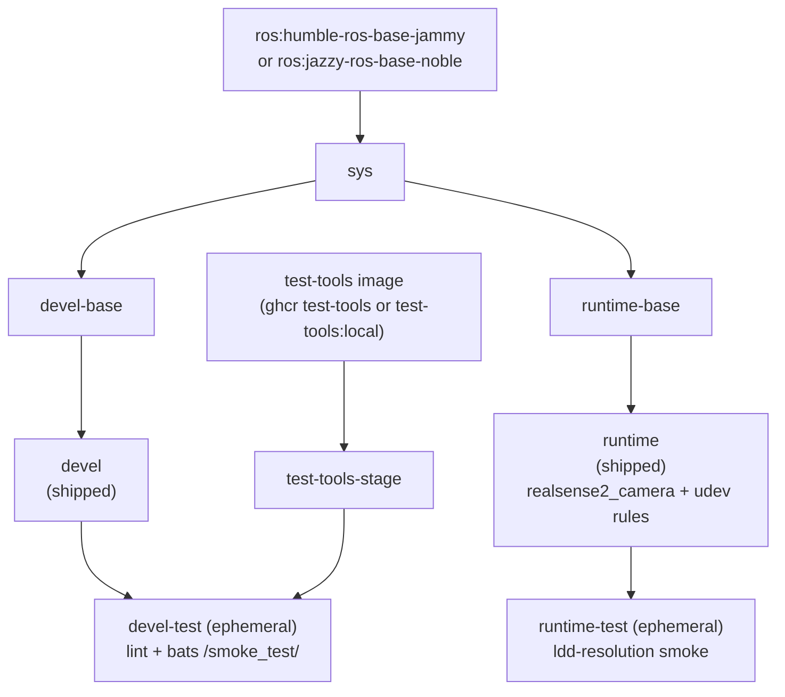

**[English](../README.md)** | **[繁體中文](README.zh-TW.md)** | **[简体中文](README.zh-CN.md)** | **[日本語](README.ja.md)**

# Intel RealSense Docker コンテナ（ROS 2）

[](https://github.com/ycpss91255-docker/realsense_ros2/actions/workflows/main.yaml) [](../LICENSE)

## TL;DR

コンテナ化された ROS 2 RealSense カメラ **アプリ**：`runtime` イメージのデフォルト CMD がカメラノードを launch し、リアルタイムの **RGB + Depth** トピックを配信します。**ピン留めしたソースから librealsense（SDK）+ realsense-ros をビルド**し（`LIBREALSENSE_VERSION` / `REALSENSE_ROS_VERSION`）、`/opt/ros/<distro>` にインストールし、USB アクセス用の udev ルールを同梱します。マルチディストロ（Humble + Jazzy）、マルチアーキ（x86_64 + ARM64 / Raspberry Pi）。

```bash
./script/install_udev_rules.sh      # once on the host (physical camera)
just build && just run -t runtime    # build + launch the camera app
# -> logs show "RealSense Node Is Up!" and depth/color streaming
```

> `just run` 単体は **devel** 開発シェルを開くだけでカメラアプリではありません -- `just run -t runtime` を使ってください。RGB-D ストリームの確認は [クイックスタート](#クイックスタート) を参照。

---

## 目次

- [概要](#概要)
- [機能](#機能)
- [前提条件](#prerequisites)
- [クイックスタート](#クイックスタート)
- [使い方](#使い方)
- [マルチマシン](#multi-machine-ros-2)
- [アンインストール / クリーンアップ](#uninstall--cleanup)
- [設定](#設定)
- [アーキテクチャ](#アーキテクチャ)
- [Smoke Tests](#smoke-tests)
- [ディレクトリ構成](#ディレクトリ構成)

---

## 概要

Intel RealSense 深度カメラ向けに、再現可能な ROS 2 環境を提供します。CI は **ROS 2 Humble（Ubuntu 22.04）と Jazzy（Ubuntu 24.04）の両方** でイメージをビルドし、それぞれ **librealsense SDK と realsense-ros wrapper をピン留めしたソースからビルド**し（`LIBREALSENSE_VERSION` / `REALSENSE_ROS_VERSION`）、両方を `/opt/ros/<distro>` にインストールします（従来 apt パッケージが配置していた場所と同じため、ament index が overlay なしで検出します）。さらに上流の udev ルールを焼き込んでいるため、USB デバイスがコンテナ内で正しい権限のもとで起動します。マルチアーキテクチャのベースイメージは x86_64 と ARM64（Raspberry Pi、Jetson CPU モード）をサポートします。

## 機能

- **マルチディストロ**：CI が単一の Dockerfile から ROS 2 Humble（Ubuntu 22.04）と Jazzy（Ubuntu 24.04）をビルド
- **ソースビルド（ピン留め）**：librealsense + realsense-ros をピン留めした tag（`LIBREALSENSE_VERSION` / `REALSENSE_ROS_VERSION`）からコンパイル；`--build-arg` で上書き可能
- **Smoke Test**：Bats テストがビルド時に自動実行され、環境を検証
- **Docker Compose**：単一の `compose.yaml` で全ターゲットを管理
- **udev ルール**：RealSense USB デバイスアクセス用に事前設定済み
- **マルチアーキテクチャ**：x86_64 と ARM64（RPi、Jetson CPU モード）をサポート

## Prerequisites

ユーザーのエントリポイントは `just` で、これが Docker を駆動します。以下をホストに一度だけインストールしてください：

- **Docker Engine + Compose plugin。** ラッパーは `docker compose` を呼び出すため、
  Compose plugin が必要です。公式の便利スクリプトは Engine + Buildx + Compose を
  まとめてインストールします：

  ```bash
  curl -fsSL https://get.docker.com | sudo sh
  sudo usermod -aG docker "$USER"   # log out/in so docker runs without sudo
  ```

  `docker compose version` で確認してください。（ディストロのパッケージ単体では
  Compose が欠けることがあります -- 例：`docker-compose-v2` なしの `docker.io` では
  `docker: unknown command: docker compose` になります。）

- **just**（コマンドランナー）。ビルド済みバイナリを `~/.local/bin` へ、sudo 不要：

  ```bash
  curl --proto '=https' --tlsv1.2 -sSf https://just.systems/install.sh | bash -s -- --to ~/.local/bin
  ```

  `~/.local/bin` が `PATH` にあることを確認し、`just --version` で確認してください。
  `just` をインストールしたくない場合のために、各レシピには生のフォールバック
  （`./script/<verb>.sh`）も用意されています。

- **（実機カメラ）ホストの udev ルール。** USB 経由で実機の RealSense を使うには、
  付属のルールをホストにインストールします（[RealSense udev ルール](#realsense-udev-rules) を参照）：

  ```bash
  ./script/install_udev_rules.sh
  ```

  これがないと、コンテナ内の非 root ユーザーは raw USB ノードを開けず、SDK がカメラを
  誤検出します -- 例：USB 3 デバイスが USB 2.1 として列挙される（"Reduced
  performance expected"）。

## クイックスタート

```bash
# 1. Build (default: ROS 2 Humble)
just build

# 2. (physical camera) install the host udev rules once
./script/install_udev_rules.sh

# 3. Launch the camera app. The `runtime` service's default command is
#    `ros2 launch realsense2_camera rs_align_depth_launch.py`; foreground shows the node logs:
just run -t runtime
#    ...or detached:
just run -d -t runtime
```

### See the RGB-D data

**CLI** -- カラー + Depth トピックが配信されているか確認します（インタラクティブな exec には `ros2` があります）：

```bash
just exec -t runtime bash -ic 'ros2 topic hz /camera/camera/color/image_raw'
just exec -t runtime bash -ic 'ros2 topic hz /camera/camera/depth/image_rect_raw'
```

**Visual** -- `rqt` で画像ストリームを表示します（`devel` イメージには `rqt_image_view` が同梱）：

```bash
just run -t devel
# inside the container:
ros2 launch realsense2_camera rs_align_depth_launch.py &     # start the camera
ros2 run rqt_image_view rqt_image_view           # pick color/image_raw and depth/image_rect_raw
```

> `-t` なしの `just run` は **devel** 開発シェルを開くだけでカメラアプリではありません -- アプリには
> `just run -t runtime` を使ってください。カメラの調整は launch 引数を渡すことで行います。例：
> `just run -t runtime ros2 launch realsense2_camera rs_launch.py pointcloud.enable:=true`、
> あるいはコマンドを丸ごと上書きします。低レベルの等価コマンドは [使い方](#使い方) を参照。

## 使い方

### ランタイム

ユーザーのエントリポイントは `just` です（リポジトリルートの `justfile` は base
サブツリーへのシンボリックリンク）。各レシピは `script/` 配下のラッパースクリプトに
1:1 で転送され、引数はそのまま渡されます。`--` 区切りは不要です。

```bash
just build                       # ビルド（デフォルト：devel）
just build test                  # devel-test ゲートをビルド
just run                         # 起動（例：just run -d）
just exec                        # 実行中のコンテナに入る
just stop                        # コンテナを停止・削除
just setup                       # setup.conf から .env + compose.yaml を再生成

docker compose build runtime     # 同等の低レベルコマンド
docker compose up runtime        # 起動
docker compose exec runtime bash # 実行中のコンテナに入る
```

### ROS 2 ディストロの選択

`just build` は Dockerfile のデフォルト（Humble / Ubuntu 22.04 jammy）を使用します。
CI は `.github/workflows/main.yaml` の `call-docker-build` マトリクスを通じて
Humble と Jazzy の両方を自動的にビルドします。ローカルで Jazzy をビルドするには、
対応する build-arg を `docker compose` 経由で渡します：

```bash
docker compose build \
  --build-arg ROS_DISTRO=jazzy \
  --build-arg ROS_TAG=ros-base \
  --build-arg UBUNTU_CODENAME=noble \
  runtime
```

### RealSense ソースバージョンのピン留め

librealsense SDK と realsense-ros wrapper はいずれも **ピン留めした git tag** から
コンパイルされます（apt ではありません）。そのためビルドは再現可能で、上流の
リグレッションを自動的に取り込むこともありません。2 つの build-arg がこれらの
tag を保持します（デフォルト値は Dockerfile 内）：

- `LIBREALSENSE_VERSION`（デフォルト `v2.58.2`）—— IntelRealSense/librealsense tag
- `REALSENSE_ROS_VERSION`（デフォルト `4.58.2`）—— IntelRealSense/realsense-ros tag

ビルド時にいずれかを上書きします：

```bash
just build --build-arg LIBREALSENSE_VERSION=v2.59.0
# または docker compose 経由：
docker compose build \
  --build-arg LIBREALSENSE_VERSION=v2.59.0 \
  --build-arg REALSENSE_ROS_VERSION=4.59.0 \
  runtime
```

SDK は RSUSB（userspace）backend でビルドされるため、ホストに **kernel module や
kernel patch は不要** です。スケジュール workflow
（`.github/workflows/upstream-bump.yaml`）が新しい上流 release を検出すると bump
PR を開きます。

### Smoke tests（test ステージ）

Smoke tests はビルド時に自動実行されます。テスト失敗時はビルドも失敗します。
`devel-test` ステージは lint（ShellCheck + Hadolint）と bats スイートを実行し、
`runtime-test` ステージはインストール済みの `realsense2_camera` ライブラリに対して
ldd 解決チェックを実行します。

```bash
just build test
# または
docker compose --profile test build test
```

## Multi-machine (ROS 2)

ROS 2 には master がありません——同じ **DDS domain** 上のノードは LAN 越しに
自動的に互いを発見するため、設定すべき `ROS_MASTER_URI` / `ROS_IP` はありません。
すべてのマシンで一致させる必要がある唯一の値は domain ID で、これはデプロイ
ごとのランタイム値なので **`.env`**（手動で書く workload overlay——`env_file:
- .env` で注入され、`just run` だけで適用され、再生成されず、git で無視される）
に置きます。マシン固有／ビルドパラメータ（GPU、privileged、マウント）は
`config/docker/setup.conf` に残します。

この repo はすでに `[network] mode = host` を出荷しているため、DDS の発見
（multicast）とトラフィックはホストの実インターフェースを使い——他のマシン
から到達できます。

**カメラ側のマシン（例：Raspberry Pi）：** `.env` に追記します

```ini
ROS_DOMAIN_ID=0    # any 0..101; MUST be identical on every machine
```

そして追加のフラグなしで起動します——compose が `.env` を注入します：

```bash
just run -t runtime
```

**もう一方のマシン：** 同じ domain を設定して購読します（任意の ROS 2 環境）：

```bash
export ROS_DOMAIN_ID=0
ros2 topic hz /camera/camera/color/image_raw   # auto-discovered, no master
```

> **要件：** 両マシンが同じサブネット上にあること；`[network] mode = host`
> （ここでのデフォルト）；そして `ROS_LOCALHOST_ONLY` が未設定または `0`
> （デフォルト——`1` にすると DDS が loopback に閉じ込められ、マシン間の発見が
> ブロックされます）。
>
> **帯域幅：** raw image topic は重いです。制約のあるリンクでは DDS の
> best-effort QoS がフレームを落とすことがあり、30 Hz のソースが約 10 Hz で
> 届くことがあります。フルレートが必要なら `compressed` image transport か
> より低いプロファイルを使ってください。

Raspberry Pi 5（カメラ）とホストの両方を `ROS_DOMAIN_ID=0` にして検証済み：
`/camera/camera/color/image_raw` はホスト上で自動発見されました（直結リンクで
約 10 Hz、上述のとおり best-effort QoS によりフレームが落ちます）。

## Uninstall / Cleanup

```bash
just stop      # stop and remove the running containers
just prune     # remove this repo's images + dangling build cache (see `just prune -h`)
```

リポジトリがホストに配置したものを完全に削除するには：

- **イメージ / ビルドキャッシュ：** `just prune`（特定のイメージは `docker image rm <tag>`）。
- **ホストの udev ルール**（インストールした場合のみ）：

  ```bash
  sudo rm -f /etc/udev/rules.d/99-realsense-libusb.rules
  sudo udevadm control --reload-rules && sudo udevadm trigger
  ```

- **リポジトリ：** クローンしたディレクトリを削除します。

## 設定

### 設定サーフェス（setup.conf）

実際の設定サーフェスは `config/docker/setup.conf` です。`just setup` がそこから
`.env` と `compose.yaml` を生成するため、`.env` は生成された成果物であり、手で
編集すべきではありません。`setup.conf` を編集（または `just setup-tui`）してから
`just setup` を再実行してください。

`setup.conf` はセクションに分かれています -- `[image]`、`[build]`、`[deploy]`、
`[gui]`、`[network]`、`[security]`、`[resources]`、`[environment]`、`[tmpfs]`、
`[devices]`、`[volumes]`。たとえば `[deploy]` セクションは GPU ランタイムキー
（`gpu_mode`、`gpu_count`、`gpu_capabilities`、`gpu_runtime`）を持ち、`[image]` は
リテラルな `image_name` キーではなく命名規則からイメージ名を導出します。

### RealSense udev ルール

udev ルールはコンテナ内だけでなく **ホスト** にインストールする必要があります。
コンテナには `udevd` がなく、デバイスノードの権限は `/dev` bind mount で共有される
ホストの `devtmpfs` inode 上にあるため、イメージに焼き込まれたルールだけでは機能
しません。ホストのルールがないと、コンテナ内の非 root ユーザーは raw USB ノードを
開けず、SDK がカメラを誤検出します（USB 2.0、`Product Line not supported` を報告、
またはファームウェア更新に失敗）。[IntelRealSense/librealsense#12022](https://github.com/IntelRealSense/librealsense/issues/12022)
を参照してください。

付属スクリプトでホストに一度だけインストールします（`sudo` を使用）：

```bash
./script/install_udev_rules.sh
```

スクリプトは `config/realsense/udev/99-realsense-libusb.rules` を `/etc/udev/rules.d/`
にコピーして udev をリロードします。その後カメラを再接続してください。コンテナ自体は
`privileged` モードで実行され、`/dev` がマウントされます。

### カメラ設定（Camera Config）

有効なカメラ profile はルートの `camera.yaml` **シンボリックリンク** で選択します
（`app/ros1_bridge` の `bridge.yaml` に倣っています）。デフォルトの対象は
`config/realsense/yaml/none.yaml` という**空ファイル**で、runtime image は標準の
アップストリームデフォルト（640x480x30、深度整列）を従来どおり起動します。
Dockerfile はリンク対象を `/camera_config.yaml` に COPY し、そのファイルが空でない
場合、entrypoint は
`ros2 launch realsense2_camera rs_launch.py config_file:=/camera_config.yaml
initial_reset:=true` を起動し、空なら既定の `CMD` を実行します。

profile を有効化するにはシンボリックリンクを張り替えるか:

```bash
ln -sf config/realsense/yaml/usb2_640x480p15fps.yaml camera.yaml
./script/build.sh
```

リンクを触らずビルドごとに build arg で指定します:

```bash
./script/build.sh --build-arg CAMERA_CONFIG=config/realsense/yaml/usb2_640x480p15fps.yaml
```

`config/realsense/` は **type-first** レイアウトで、**独自の**カメラ profile を
種類別に保管します：

```text
config/realsense/
├── yaml/            # 独自のカメラ profile（none + 名前付き preset）
├── json/
│   └── d500_tables/ # vendored realsense-ros D500 サンプル JSON tables
└── udev/            # vendored librealsense udev rules
```

vendored realsense-ros のドリフト基準（`config.yaml`、`global_settings.yaml`）は
`.github/upstream-baseline/` に置かれています -- これは CI のドリフト fixture であり、ユーザー設定ではなく、image にも焼き込まれません。

#### `yaml/` -- 独自 profile

解像度ごとに 1 つの preset、そのリンクの最大 fps で用意します。**depth は常に
1280x720**（カメラ最高の深度解像度）、上限 30 fps。各 preset は infra
（`enable_infra1/2`）と IMU（`enable_gyro/accel`）をオフにし、整列深度は有効のまま
です。`none.yaml` は空の 0-byte マーカー = 標準/デフォルト（`camera.yaml` symlink の
デフォルト対象）。

| ファイル | Color | 整列深度 | リンク |
|----------|-------|----------|--------|
| `none.yaml` | （空） | 標準デフォルト | -- |
| `usb3_1280x720p30fps.yaml` | 1280x720x30 | 1280x720x30 | USB3 |
| `usb3_848x480p60fps.yaml` | 848x480x60 | 1280x720x30 | USB3 |
| `usb3_640x480p60fps.yaml` | 640x480x60 | 1280x720x30 | USB3 |
| `usb3_424x240p90fps.yaml` | 424x240x90 | 1280x720x30 | USB3 |
| `usb2_1280x720p6fps.yaml` | 1280x720x6 | 1280x720x6 | USB2（未検証） |
| `usb2_640x480p15fps.yaml` | 640x480x15 | 1280x720x15 | USB2（未検証） |
| `usb2_424x240p30fps.yaml` | 424x240x30 | 1280x720x30 | USB2（未検証） |

USB3 preset は D455 上で `rs-enumerate-devices` により列挙しました。**USB2 preset は
未検証**です：カメラは USB3 リンク上にあり USB2 ホワイトリストは列挙していません --
720p depth が USB2 帯域を超えるか、提供されない可能性があります。実際の USB2 リンクで
各々検証してください（D435/D455 は USB 2 接続では標準の 640x480x30 color + depth を
維持できず、30 fps では **0 フレーム**しか出しません）。

#### `.github/upstream-baseline/`、`json/d500_tables/`、`udev/` -- vendored 上流（手動編集しないこと）

vendored ファイルは上流のピン留め tag から **verbatim** でコピーされ、ドリフト
チェックの基準になります。2 つの上流が対象です -- `realsense-ros` wrapper
（`REALSENSE_ROS_VERSION` でピン留め）と `librealsense` SDK（`LIBREALSENSE_VERSION`
でピン留め）：

| ファイル | 上流ソース @ ピン留め tag | ドリフトチェック |
|----------|----------------------------|-------------------|
| `.github/upstream-baseline/config.yaml` | realsense-ros `realsense2_camera/examples/launch_params_from_file/config/config.yaml` | `check_configs_sync.sh` |
| `.github/upstream-baseline/global_settings.yaml` | realsense-ros `realsense2_camera/CMakeLists.txt`（デフォルト `USE_LIFECYCLE_NODE=OFF` -> `use_lifecycle_node: false`） | `check_configs_sync.sh` |
| `json/d500_tables/*.json` | realsense-ros `realsense2_camera/examples/d500_tables/*.json` | （なし） |
| `udev/99-realsense-libusb.rules` | librealsense `config/99-realsense-libusb.rules` | `check_udev_rules_sync.sh` |

`.github/workflows/upstream-bump.yaml` が両方のドリフトチェックを定期実行し、vendored
コピーがピン留め上流と乖離したとき警告します。上流のバージョン更新時はその場で編集せず
再 vendored してください。

## アーキテクチャ

### Docker ビルドステージ図



### ステージ説明

| ステージ | FROM | 用途 |
|----------|------|------|
| `test-tools-stage` | `${TEST_TOOLS_IMAGE}`（マルチアーキの ghcr test-tools、または `test-tools:local`） | ShellCheck + Hadolint + Bats、出荷しない |
| `sys` | `ros:<distro>-ros-base-<codename>`（humble-jammy / jazzy-noble） | 共通ベース：ユーザー、ロケール、タイムゾーン（base v0.41.0 build contract） |
| `devel-base` | `sys` | 開発ツール + ROS 2 desktop + RealSense パッケージ + Dynamic Calibration Tool（amd64） |
| `devel` | `devel-base` | 出荷する開発イメージ（デフォルト CMD `bash`） |
| `devel-test` | `devel` + `test-tools-stage` | Lint + smoke tests、ビルド後に破棄（一時的） |
| `runtime-base` | `sys` | 最小ベース（`sudo`、`tini`） |
| `runtime` | `runtime-base` | 出荷するランタイムイメージ：RealSense パッケージ + udev ルール（デフォルト CMD `ros2 launch realsense2_camera rs_align_depth_launch.py`） |
| `runtime-test` | `runtime` | `realsense2_camera` ライブラリに対する ldd 解決 smoke、ビルド後に破棄（一時的） |

## Smoke Tests

ビルド時の自動テストは [TEST.md](test/TEST.md)、実機カメラでのテストは [CAMERA.md](CAMERA.md)、動的キャリブレーションツールは [CALIBRATION.md](CALIBRATION.md) を参照。

## ディレクトリ構成

```text
realsense_ros2/
├── Dockerfile                   # マルチステージビルド
├── LICENSE
├── README.md
├── camera.yaml -> config/realsense/yaml/none.yaml # シンボリックリンク（有効なカメラ設定；デフォルト = 標準）
├── justfile -> .base/script/docker/justfile        # シンボリックリンク（ユーザーエントリポイント）
├── .hadolint.yaml -> .base/.hadolint.yaml          # シンボリックリンク
├── .base/                       # base サブツリー（読み取り専用；v0.41.0）
├── script/
│   ├── entrypoint.sh            # コンテナエントリポイント（リポジトリ所有）
│   ├── install_udev_rules.sh    # ホストに RealSense udev ルールをインストール（リポジトリ所有）
│   ├── check_udev_rules_sync.sh # vendored udev ルールとピン留め SDK tag の同期を確認（リポジトリ所有）
│   ├── check_configs_sync.sh    # vendored サンプル設定とピン留め realsense-ros tag の同期を確認（リポジトリ所有）
│   ├── bump_realsense_versions.sh # ピン留め SDK/wrapper tag を更新（リポジトリ所有；upstream-bump を駆動）
│   ├── build.sh -> ../.base/script/docker/wrapper/build.sh   # シンボリックリンク
│   ├── run.sh   -> ../.base/script/docker/wrapper/run.sh     # シンボリックリンク
│   ├── exec.sh  -> ../.base/script/docker/wrapper/exec.sh    # シンボリックリンク
│   ├── stop.sh  -> ../.base/script/docker/wrapper/stop.sh    # シンボリックリンク
│   ├── prune.sh -> ../.base/script/docker/wrapper/prune.sh   # シンボリックリンク
│   ├── setup.sh -> ../.base/script/docker/wrapper/setup.sh   # シンボリックリンク
│   ├── setup_tui.sh -> ../.base/script/docker/wrapper/setup_tui.sh  # シンボリックリンク
│   └── hooks/                   # pre/ + post/ ラッパーフック
│       └── pre/build.sh         # librealsense:local を自動ビルドし、ローカルビルドを自己完結にする（repo 所有）
├── docker/
│   └── librealsense/
│       └── Dockerfile           # プレビルド librealsense SDK ソース image（ローカル：pre-build hook／CI：GHCR へ公開）
├── config/
│   ├── docker/
│   │   └── setup.conf           # 設定サーフェス（.env/compose.yaml はここから生成）
│   └── realsense/                     # type-first：yaml/ + json/ + udev/
│       ├── yaml/                      # 独自の profile（none + 名前付き preset）
│       │   ├── none.yaml                 # 空ファイル = 標準/デフォルト（camera.yaml のデフォルト対象）
│       │   ├── usb3_1280x720p30fps.yaml  # USB3 profile（color 1280x720x30、整列深度 1280x720x30）
│       │   ├── usb3_848x480p60fps.yaml   # USB3 profile（color 848x480x60、整列深度 1280x720x30）
│       │   ├── usb3_640x480p60fps.yaml   # USB3 profile（color 640x480x60、整列深度 1280x720x30）
│       │   ├── usb3_424x240p90fps.yaml   # USB3 profile（color 424x240x90、整列深度 1280x720x30）
│       │   ├── usb2_1280x720p6fps.yaml   # USB2 profile（color 1280x720x6、整列深度 1280x720x6；未検証）
│       │   ├── usb2_640x480p15fps.yaml   # USB2 profile（color 640x480x15、整列深度 1280x720x15；未検証）
│       │   └── usb2_424x240p30fps.yaml   # USB2 profile（color 424x240x30、整列深度 1280x720x30；未検証）
│       ├── json/
│       │   └── d500_tables/          # vendored D500 サンプル JSON テーブル（realsense-ros）
│       └── udev/
│           └── 99-realsense-libusb.rules  # RealSense udev ルール（librealsense SDK から vendored）
├── doc/
│   ├── README.zh-TW.md          # 繁体字中国語
│   ├── README.zh-CN.md          # 簡体字中国語
│   ├── README.ja.md             # 日本語
│   ├── adr/                     # アーキテクチャ決定記録（ADR）
│   ├── CAMERA.md               # 実機カメラでの手動テスト
│   ├── CALIBRATION.md          # 動的キャリブレーションツール解説
│   ├── changelog/CHANGELOG.md
│   └── test/
│       └── TEST.md             # ビルド時の自動 smoke テスト
├── .github/
│   ├── upstream-baseline/       # vendored realsense-ros ドリフト基準（config.yaml + global_settings.yaml；CI fixture、image に焼き込まない）
│   └── workflows/
│       ├── main.yaml                # CI（base の再利用可能な build/release ワーカーを呼び出す）
│       ├── build-librealsense.yaml  # プレビルド librealsense SDK image（Ubuntu プラットフォーム別：jammy/noble）を GHCR へ公開
│       └── upstream-bump.yaml       # スケジュール：新しい上流 release で bump PR を開く
└── test/
    └── smoke/                   # リポジトリ所有の bats テスト
        └── ros_env.bats         # （ヘルパーと追加の .bats は .base/test/smoke/ から）
```
