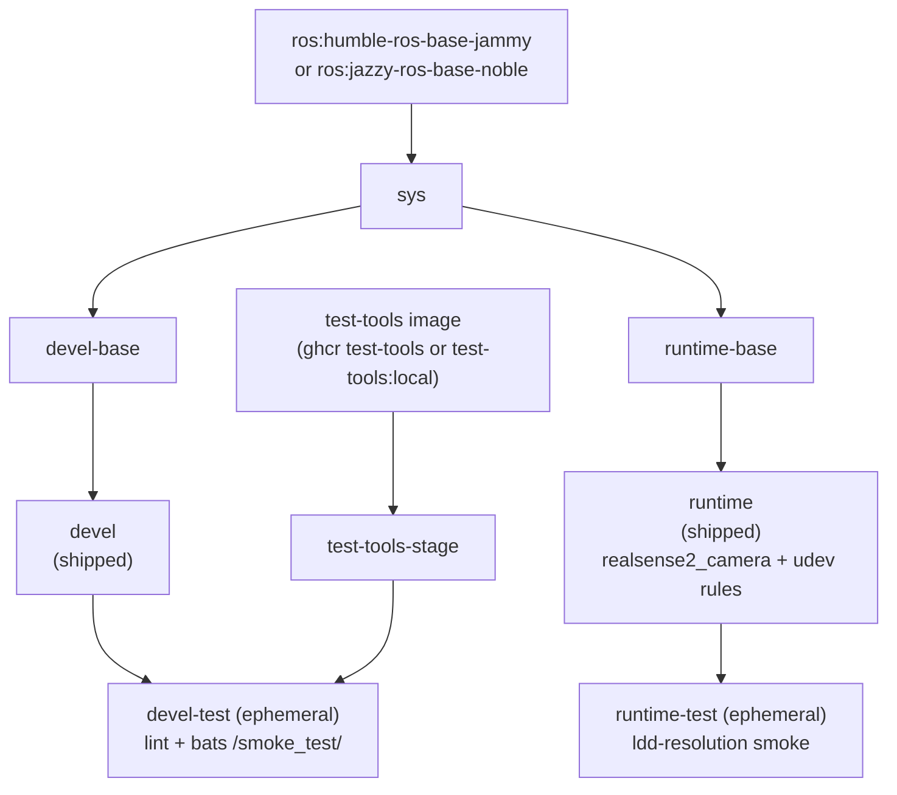

**[English](../README.md)** | **[繁體中文](README.zh-TW.md)** | **[简体中文](README.zh-CN.md)** | **[日本語](README.ja.md)**

# Intel RealSense Docker コンテナ（ROS 2）

[](https://github.com/ycpss91255-docker/realsense_ros2/actions/workflows/main.yaml) [](../LICENSE)

## TL;DR

コンテナ化された ROS 2 向け Intel RealSense ドライバ。apt から `realsense2-camera` と `realsense2-description` をインストールし（これにより `librealsense2` が依存関係として推移的に取り込まれます）、デバイスアクセス用の udev ルールを含みます。

```bash
just build && just run
```

---

## 目次

- [概要](#概要)
- [機能](#機能)
- [クイックスタート](#クイックスタート)
- [使い方](#使い方)
- [設定](#設定)
- [アーキテクチャ](#アーキテクチャ)
- [Smoke Tests](#smoke-tests)
- [ディレクトリ構成](#ディレクトリ構成)

---

## 概要

Intel RealSense 深度カメラ向けに、再現可能な ROS 2 環境を提供します。CI は **ROS 2 Humble（Ubuntu 22.04）と Jazzy（Ubuntu 24.04）の両方** でイメージをビルドし、それぞれ対応する `ros-<distro>-realsense2-camera` と `ros-<distro>-realsense2-description` パッケージを ROS 2 apt リポジトリからインストールします（`librealsense2` ライブラリはその依存関係として推移的に取り込まれます）。さらに上流の udev ルールを焼き込んでいるため、USB デバイスがコンテナ内で正しい権限のもとで起動します。マルチアーキテクチャのベースイメージは x86_64 と ARM64（Raspberry Pi、Jetson CPU モード）をサポートします。

## 機能

- **マルチディストロ**：CI が単一の Dockerfile から ROS 2 Humble（Ubuntu 22.04）と Jazzy（Ubuntu 24.04）をビルド
- **Apt ベースのインストール**：ROS 2 apt リポジトリから `realsense2-camera` と `realsense2-description`（`librealsense2` は推移的に取り込まれる）
- **Smoke Test**：Bats テストがビルド時に自動実行され、環境を検証
- **Docker Compose**：単一の `compose.yaml` で全ターゲットを管理
- **udev ルール**：RealSense USB デバイスアクセス用に事前設定済み
- **マルチアーキテクチャ**：x86_64 と ARM64（RPi、Jetson CPU モード）をサポート

## クイックスタート

```bash
# 1. ビルド
just build

# 2. 実行（デフォルト：ros2 launch realsense2_camera rs_launch.py）
just run

# または docker compose を直接使用
docker compose up runtime
docker compose down
```

## 使い方

### ランタイム

ユーザーのエントリポイントは `just` です（リポジトリルートの `justfile` は base
サブツリーへのシンボリックリンク）。各レシピは `script/` 配下のラッパースクリプトに
1:1 で転送され、引数はそのまま渡されます。`--` 区切りは不要です。

```bash
just build                       # ビルド（デフォルト：devel）
just build test                  # devel-test ゲートをビルド
just run                         # 起動（例：just run -d）
just exec                        # 実行中のコンテナに入る
just stop                        # コンテナを停止・削除
just setup                       # setup.conf から .env + compose.yaml を再生成

docker compose build runtime     # 同等の低レベルコマンド
docker compose up runtime        # 起動
docker compose exec runtime bash # 実行中のコンテナに入る
```

### ROS 2 ディストロの選択

`just build` は Dockerfile のデフォルト（Humble / Ubuntu 22.04 jammy）を使用します。
CI は `.github/workflows/main.yaml` の `call-docker-build` マトリクスを通じて
Humble と Jazzy の両方を自動的にビルドします。ローカルで Jazzy をビルドするには、
対応する build-arg を `docker compose` 経由で渡します：

```bash
docker compose build \
  --build-arg ROS_DISTRO=jazzy \
  --build-arg ROS_TAG=ros-base \
  --build-arg UBUNTU_CODENAME=noble \
  runtime
```

### Smoke tests（test ステージ）

Smoke tests はビルド時に自動実行されます。テスト失敗時はビルドも失敗します。
`devel-test` ステージは lint（ShellCheck + Hadolint）と bats スイートを実行し、
`runtime-test` ステージはインストール済みの `realsense2_camera` ライブラリに対して
ldd 解決チェックを実行します。

```bash
just build test
# または
docker compose --profile test build test
```

## 設定

### 設定サーフェス（setup.conf）

実際の設定サーフェスは `config/docker/setup.conf` です。`just setup` がそこから
`.env` と `compose.yaml` を生成するため、`.env` は生成された成果物であり、手で
編集すべきではありません。`setup.conf` を編集（または `just setup-tui`）してから
`just setup` を再実行してください。

`setup.conf` はセクションに分かれています -- `[image]`、`[build]`、`[deploy]`、
`[gui]`、`[network]`、`[security]`、`[resources]`、`[environment]`、`[tmpfs]`、
`[devices]`、`[volumes]`。たとえば `[deploy]` セクションは GPU ランタイムキー
（`gpu_mode`、`gpu_count`、`gpu_capabilities`、`gpu_runtime`）を持ち、`[image]` は
リテラルな `image_name` キーではなく命名規則からイメージ名を導出します。

### RealSense udev ルール

udev ルールはコンテナ内だけでなく **ホスト** にインストールする必要があります。
コンテナには `udevd` がなく、デバイスノードの権限は `/dev` bind mount で共有される
ホストの `devtmpfs` inode 上にあるため、イメージに焼き込まれたルールだけでは機能
しません。ホストのルールがないと、コンテナ内の非 root ユーザーは raw USB ノードを
開けず、SDK がカメラを誤検出します（USB 2.0、`Product Line not supported` を報告、
またはファームウェア更新に失敗）。[IntelRealSense/librealsense#12022](https://github.com/IntelRealSense/librealsense/issues/12022)
を参照してください。

付属スクリプトでホストに一度だけインストールします（`sudo` を使用）：

```bash
./script/install_udev_rules.sh
```

スクリプトは `config/realsense/99-realsense-libusb.rules` を `/etc/udev/rules.d/`
にコピーして udev をリロードします。その後カメラを再接続してください。コンテナ自体は
`privileged` モードで実行され、`/dev` がマウントされます。

## アーキテクチャ

### Docker ビルドステージ図



### ステージ説明

| ステージ | FROM | 用途 |
|----------|------|------|
| `test-tools-stage` | `${TEST_TOOLS_IMAGE}`（マルチアーキの ghcr test-tools、または `test-tools:local`） | ShellCheck + Hadolint + Bats、出荷しない |
| `sys` | `ros:<distro>-ros-base-<codename>`（humble-jammy / jazzy-noble） | 共通ベース：ユーザー、ロケール、タイムゾーン（base v0.41.0 build contract） |
| `devel-base` | `sys` | 開発ツール + ROS 2 desktop + RealSense パッケージ + Dynamic Calibration Tool（amd64） |
| `devel` | `devel-base` | 出荷する開発イメージ（デフォルト CMD `bash`） |
| `devel-test` | `devel` + `test-tools-stage` | Lint + smoke tests、ビルド後に破棄（一時的） |
| `runtime-base` | `sys` | 最小ベース（`sudo`、`tini`） |
| `runtime` | `runtime-base` | 出荷するランタイムイメージ：RealSense パッケージ + udev ルール（デフォルト CMD `ros2 launch realsense2_camera rs_launch.py`） |
| `runtime-test` | `runtime` | `realsense2_camera` ライブラリに対する ldd 解決 smoke、ビルド後に破棄（一時的） |

## Smoke Tests

ビルド時の自動テストは [TEST.md](test/TEST.md)、実機カメラでのテストは [CAMERA.md](CAMERA.md)、動的キャリブレーションツールは [CALIBRATION.md](CALIBRATION.md) を参照。

## ディレクトリ構成

```text
realsense_ros2/
├── Dockerfile                   # マルチステージビルド
├── LICENSE
├── README.md
├── justfile -> .base/script/docker/justfile        # シンボリックリンク（ユーザーエントリポイント）
├── .hadolint.yaml -> .base/.hadolint.yaml          # シンボリックリンク
├── .base/                       # base サブツリー（読み取り専用；v0.41.0）
├── script/
│   ├── entrypoint.sh            # コンテナエントリポイント（リポジトリ所有）
│   ├── install_udev_rules.sh    # ホストに RealSense udev ルールをインストール（リポジトリ所有）
│   ├── build.sh -> ../.base/script/docker/wrapper/build.sh   # シンボリックリンク
│   ├── run.sh   -> ../.base/script/docker/wrapper/run.sh     # シンボリックリンク
│   ├── exec.sh  -> ../.base/script/docker/wrapper/exec.sh    # シンボリックリンク
│   ├── stop.sh  -> ../.base/script/docker/wrapper/stop.sh    # シンボリックリンク
│   ├── prune.sh -> ../.base/script/docker/wrapper/prune.sh   # シンボリックリンク
│   ├── setup.sh -> ../.base/script/docker/wrapper/setup.sh   # シンボリックリンク
│   ├── setup_tui.sh -> ../.base/script/docker/wrapper/setup_tui.sh  # シンボリックリンク
│   └── hooks/                   # pre/ + post/ ラッパーフック
├── config/
│   ├── docker/
│   │   └── setup.conf           # 設定サーフェス（.env/compose.yaml はここから生成）
│   └── realsense/
│       └── 99-realsense-libusb.rules  # RealSense udev ルール
├── doc/
│   ├── README.zh-TW.md          # 繁体字中国語
│   ├── README.zh-CN.md          # 簡体字中国語
│   ├── README.ja.md             # 日本語
│   ├── adr/                     # アーキテクチャ決定記録（ADR）
│   ├── CAMERA.md               # 実機カメラでの手動テスト
│   ├── CALIBRATION.md          # 動的キャリブレーションツール解説
│   ├── changelog/CHANGELOG.md
│   └── test/
│       └── TEST.md             # ビルド時の自動 smoke テスト
├── .github/workflows/
│   └── main.yaml                # CI（base の再利用可能な build/release ワーカーを呼び出す）
└── test/
    └── smoke/                   # リポジトリ所有の bats テスト
        └── ros_env.bats         # （ヘルパーと追加の .bats は .base/test/smoke/ から）
```
