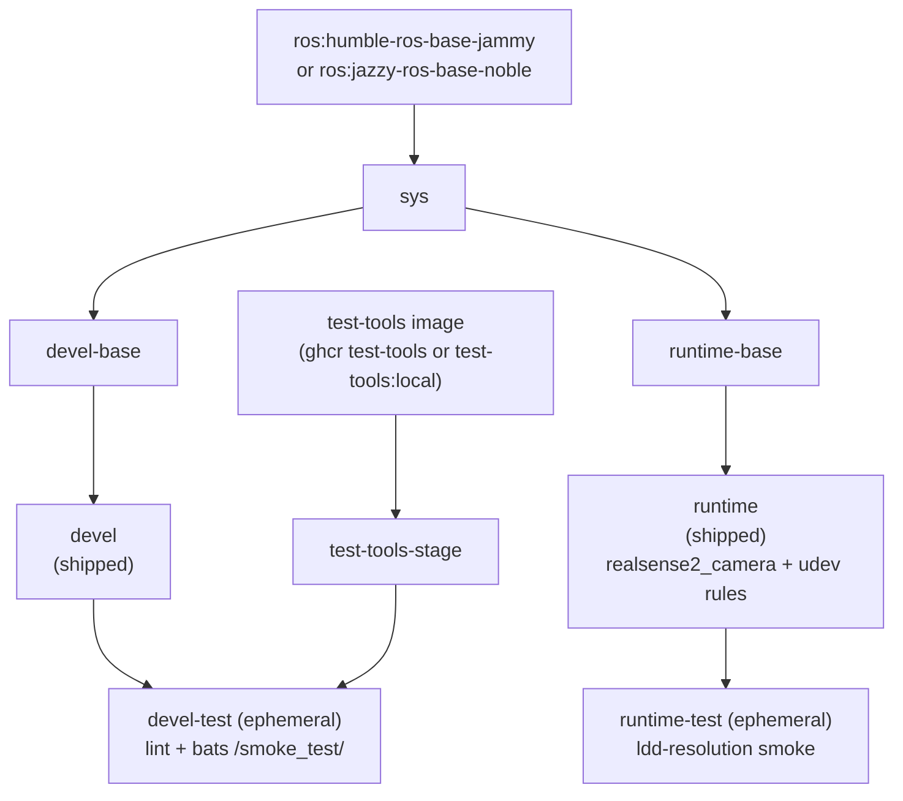

**[English](../README.md)** | **[繁體中文](README.zh-TW.md)** | **[简体中文](README.zh-CN.md)** | **[日本語](README.ja.md)**

# Intel RealSense Docker 容器（ROS 2）

[](https://github.com/ycpss91255-docker/realsense_ros2/actions/workflows/main.yaml) [](../LICENSE)

## TL;DR

这是一个容器化的 ROS 2 RealSense 相机 **app**：`runtime` 镜像的默认 CMD 就会 launch 相机节点、发布实时 **RGB + Depth** topic。从**固定的源码构建 librealsense（SDK）+ realsense-ros**（`LIBREALSENSE_VERSION` / `REALSENSE_ROS_VERSION`），安装到 `/opt/ros/<distro>`，并内含 udev 规则以供 USB 访问。多发行版（Humble + Jazzy）、多架构（x86_64 + ARM64 / 树莓派）。

```bash
./script/install_udev_rules.sh      # host 装一次（实体相机）
just build && just run -t runtime    # build + 启动相机 app
# -> log 显示 "RealSense Node Is Up!" 与 depth/color 流
```

> `just run` 自身只开 **devel** 开发 shell、不是相机 app —— 要用 `just run -t runtime`。见 [Quick Start](#快速开始) 观看 RGB-D 流。

## 目录

- [概述](#概述)
- [功能特性](#功能特性)
- [前置条件](#prerequisites)
- [快速开始](#快速开始)
- [使用方式](#使用方式)
- [多机连接](#multi-machine-ros-2)
- [卸载 / 清理](#uninstall--cleanup)
- [配置](#配置)
- [架构](#架构)
- [Smoke Tests](#smoke-tests)
- [目录结构](#目录结构)

---

## 概述

为 Intel RealSense 深度相机提供可复现的 ROS 2 环境。CI 会**同时构建 ROS 2 Humble（Ubuntu 22.04）与 Jazzy（Ubuntu 24.04）**两个版本；每个版本都**从固定的源码构建 librealsense SDK 与 realsense-ros wrapper**（`LIBREALSENSE_VERSION` / `REALSENSE_ROS_VERSION`），并将两者安装到 `/opt/ros/<distro>`（与过去 apt 软件包的落点相同，因此 ament index 无需 overlay 即可发现）。镜像内置上游 udev 规则，使 USB 设备在容器内以正确的权限挂载。多架构基础镜像支持 x86_64 和 ARM64（树莓派、Jetson CPU 模式）。

## 功能特性

- **多发行版**：CI 从同一份 Dockerfile 构建 ROS 2 Humble（Ubuntu 22.04）与 Jazzy（Ubuntu 24.04）
- **源码构建（固定版本）**：librealsense + realsense-ros 由固定的 tag（`LIBREALSENSE_VERSION` / `REALSENSE_ROS_VERSION`）编译；可用 `--build-arg` 覆盖
- **Smoke Test**：Bats 测试在构建时自动执行，验证环境正确性
- **Docker Compose**：单一 `compose.yaml` 管理所有目标
- **udev 规则**：预配置 RealSense USB 设备访问权限
- **多架构支持**：支持 x86_64 和 ARM64（RPi、Jetson CPU 模式）

## Prerequisites

用户入口是 `just`，由它驱动 Docker。请在 host 上一次性安装以下工具：

- **Docker Engine + Compose plugin。** wrapper 脚本会调用 `docker compose`，因此必须
  装有 Compose plugin。官方便捷脚本会一并安装 Engine + Buildx + Compose：

  ```bash
  curl -fsSL https://get.docker.com | sudo sh
  sudo usermod -aG docker "$USER"   # log out/in so docker runs without sudo
  ```

  用 `docker compose version` 验证。（仅装发行版软件包可能缺少 Compose ——
  例如只装 `docker.io` 而没有 `docker-compose-v2`，会得到 `docker: unknown command:
  docker compose`。）

- **just**（命令运行器）。将预编译二进制安装到 `~/.local/bin`，无需 sudo：

  ```bash
  curl --proto '=https' --tlsv1.2 -sSf https://just.systems/install.sh | bash -s -- --to ~/.local/bin
  ```

  确保 `~/.local/bin` 在 `PATH` 中，然后用 `just --version` 验证。如果你不想安装
  `just`，每个 recipe 也都有原始回退命令（`./script/<verb>.sh`）。

- **（实体相机）host udev 规则。** 要通过 USB 使用真实的 RealSense，请在 host 上安装
  内附的规则（见 [RealSense udev 规则](#realsense-udev-rules)）：

  ```bash
  ./script/install_udev_rules.sh
  ```

  不安装的话，容器内的非 root 用户就无法打开 raw USB 节点，SDK 会误判相机 ——
  例如把 USB 3 设备识别成 USB 2.1（"Reduced performance expected"）。

## 快速开始

```bash
# 1. 构建（默认：ROS 2 Humble）
just build

# 2. （实体相机）在 host 上安装一次 udev 规则
./script/install_udev_rules.sh

# 3. 启动相机 app。`runtime` service 的默认命令是
#    `ros2 launch realsense2_camera rs_align_depth_launch.py`；前台会显示节点 log：
just run -t runtime
#    ...或后台运行：
just run -d -t runtime
```

### See the RGB-D data

**CLI** —— 确认 color + depth topic 正在串流（交互式 exec 内有 `ros2`）：

```bash
just exec -t runtime bash -ic 'ros2 topic hz /camera/camera/color/image_raw'
just exec -t runtime bash -ic 'ros2 topic hz /camera/camera/depth/image_rect_raw'
```

**Visual** —— 用 `rqt` 查看图像流（`devel` 镜像内含 `rqt_image_view`）：

```bash
just run -t devel
# inside the container:
ros2 launch realsense2_camera rs_align_depth_launch.py &     # start the camera
ros2 run rqt_image_view rqt_image_view           # pick color/image_raw and depth/image_rect_raw
```

> 不带 `-t` 的 `just run` 开的是 **devel** 开发 shell、不是相机 app —— app 要用
> `just run -t runtime`。可通过传 launch 参数调整相机，例如
> `just run -t runtime ros2 launch realsense2_camera rs_launch.py pointcloud.enable:=true`，
> 或完全覆写命令。底层等价命令见 [Usage](#使用方式)。

## 使用方式

### 运行环境

用户入口是 `just`（仓库根目录的 `justfile` 符号链接到 base subtree）。
各 recipe 以 1:1 方式转发到 `script/` 下的 wrapper 脚本，并完整透传参数 ——
无需 `--` 分隔符。

```bash
just build                       # 构建（默认：devel）
just build test                  # 构建 devel-test 关卡
just run                         # 启动（例如 just run -d）
just exec                        # 进入运行中的容器
just stop                        # 停止并移除容器
just setup                       # 从 setup.conf 重新生成 .env + compose.yaml

docker compose build runtime     # 等效的底层命令
docker compose up runtime        # 启动
docker compose exec runtime bash # 进入运行中的容器
```

### 选择 ROS 2 发行版

`just build` 使用 Dockerfile 的默认值（Humble / Ubuntu 22.04 jammy）。CI 会通过
`.github/workflows/main.yaml` 中的 `call-docker-build` matrix 自动构建 Humble 与
Jazzy 两个版本。要在本机构建 Jazzy，请通过 `docker compose` 传入对应的 build args：

```bash
docker compose build \
  --build-arg ROS_DISTRO=jazzy \
  --build-arg ROS_TAG=ros-base \
  --build-arg UBUNTU_CODENAME=noble \
  runtime
```

### 固定 RealSense 源码版本

librealsense SDK 与 realsense-ros wrapper 均从**固定的 git tag** 编译（非 apt），
因此构建可复现，也不会自动带入上游的回归问题。两个 build-arg 保存这些 tag
（默认值位于 Dockerfile）：

- `LIBREALSENSE_VERSION`（默认 `v2.58.2`）—— IntelRealSense/librealsense tag
- `REALSENSE_ROS_VERSION`（默认 `4.58.2`）—— IntelRealSense/realsense-ros tag

在构建时覆盖其中之一：

```bash
just build --build-arg LIBREALSENSE_VERSION=v2.59.0
# 或通过 docker compose：
docker compose build \
  --build-arg LIBREALSENSE_VERSION=v2.59.0 \
  --build-arg REALSENSE_ROS_VERSION=4.59.0 \
  runtime
```

SDK 以 RSUSB（userspace）backend 构建，因此 host **不需要 kernel module 或
kernel patch**。调度 workflow（`.github/workflows/upstream-bump.yaml`）会在有新的
上游 release 时开启 bump PR。

### Smoke tests（test 阶段）

Smoke tests 在构建时自动执行；测试失败则构建失败。`devel-test` 阶段运行
lint（ShellCheck + Hadolint）以及 bats 测试套件，`runtime-test` 阶段对已安装的
`realsense2_camera` 库运行 ldd 解析检查。

```bash
just build test
# 或
docker compose --profile test build test
```

## Multi-machine (ROS 2)

ROS 2 没有 master——同一个 **DDS domain** 上的节点会通过 LAN 自动互相发现，
因此没有 `ROS_MASTER_URI` / `ROS_IP` 需要设置。每台机器唯一必须一致的值是
domain ID，这是每次部署时的运行期数值，所以它放在 **`.env`**（手动撰写的
workload overlay——通过 `env_file: - .env` 注入，仅由 `just run` 应用，永远
不会被重新生成，且已被 git 忽略）。机器层级／构建参数（GPU、privileged、
挂载）则留在 `config/docker/setup.conf`。

此 repo 已默认 `[network] mode = host`，所以 DDS 发现（multicast）与流量都走
主机真实网卡——其他机器可以连得到。

**在相机端机器（例如 Raspberry Pi）：** 在 `.env` 加入

```ini
ROS_DOMAIN_ID=0    # any 0..101; MUST be identical on every machine
```

接着无需任何额外旗标即可启动——compose 会注入 `.env`：

```bash
just run -t runtime
```

**在另一台机器：** 设置相同的 domain 并订阅（任何 ROS 2 环境皆可）：

```bash
export ROS_DOMAIN_ID=0
ros2 topic hz /camera/camera/color/image_raw   # auto-discovered, no master
```

> **需求条件：** 两台机器位于同一个子网；`[network] mode = host`（此处的
> 默认值）；且 `ROS_LOCALHOST_ONLY` 未设置或为 `0`（默认——设为 `1` 会将 DDS
> 限制在 loopback，阻挡跨机器发现）。
>
> **带宽：** 原始图像 topic 很重。在受限的连接上 DDS best-effort QoS 可能会
> 丢 frame，因此 30 Hz 的来源可能只收到约 10 Hz。若需要完整 frame rate，请
> 改用 `compressed` image transport 或较低的 profile。

已在 Raspberry Pi 5（相机）与一台主机上验证，两者皆 `ROS_DOMAIN_ID=0`：
`/camera/camera/color/image_raw` 在主机上被自动发现（通过直连约 10 Hz，
如上所述 frame 因 best-effort QoS 而被丢弃）。

## Uninstall / Cleanup

```bash
just stop      # stop and remove the running containers
just prune     # remove this repo's images + dangling build cache (see `just prune -h`)
```

要彻底移除该仓库放在 host 上的内容：

- **镜像 / 构建缓存：** `just prune`（或用 `docker image rm <tag>` 移除特定镜像）。
- **Host udev 规则**（仅当你安装过时）：

  ```bash
  sudo rm -f /etc/udev/rules.d/99-realsense-libusb.rules
  sudo udevadm control --reload-rules && sudo udevadm trigger
  ```

- **仓库本身：** 删除克隆下来的目录。

## 配置

### 配置面（setup.conf）

真正的配置面是 `config/docker/setup.conf`。`just setup` 会据此生成 `.env` 和
`compose.yaml`，因此 `.env` 是生成产物，不应手动编辑。请编辑 `setup.conf`
（或 `just setup-tui`）后重新运行 `just setup`。

`setup.conf` 划分为若干区段 —— `[image]`、`[build]`、`[deploy]`、`[gui]`、
`[network]`、`[security]`、`[resources]`、`[environment]`、`[tmpfs]`、
`[devices]`、`[volumes]`。例如 `[deploy]` 区段承载 GPU 运行时键
（`gpu_mode`、`gpu_count`、`gpu_capabilities`、`gpu_runtime`），而 `[image]`
依据命名规则推导镜像名称，而非使用字面的 `image_name` 键。

### RealSense udev 规则

udev 规则必须装在 **host**，而不仅仅是容器内。容器没有 `udevd`，而设备节点的权限
位于通过 `/dev` bind mount 共享的 host `devtmpfs` inode 上，所以镜像内置的那份规则
本身不会生效。缺少 host 规则，容器内的非 root 用户就无法打开 raw USB 节点，SDK 会
误判相机（报告 USB 2.0、`Product Line not supported`，或固件更新失败）。详见
[IntelRealSense/librealsense#12022](https://github.com/IntelRealSense/librealsense/issues/12022)。

用内附脚本在 host 上安装一次即可（会使用 `sudo`）：

```bash
./script/install_udev_rules.sh
```

脚本会把 `config/realsense/99-realsense-libusb.rules` 复制到 `/etc/udev/rules.d/`
并重新加载 udev，之后请重新插拔相机。容器本身以 `privileged` 模式运行并挂载 `/dev`。

### 相机配置（Camera Config）

启用中的相机 profile 由根目录的 `camera.yaml` **符号链接** 选定（比照
`app/ros1_bridge` 的 `bridge.yaml`）。默认目标是
`config/realsense/custom/none.yaml`，一个**空文件**，因此 runtime image 会启动
原厂上游默认（640x480x30，对齐深度），行为与之前完全一致。Dockerfile 会把
符号链接目标 COPY 成 `/camera_config.yaml`；当该文件非空时，entrypoint 会执行
`ros2 launch realsense2_camera rs_launch.py config_file:=/camera_config.yaml
initial_reset:=true`，否则执行默认 `CMD`。

启用某个 profile 可以重指符号链接：

```bash
ln -sf config/realsense/custom/usb2.yaml camera.yaml
./script/build.sh
```

或不动符号链接，单次以 build arg 指定：

```bash
./script/build.sh --build-arg CAMERA_CONFIG=config/realsense/custom/usb2.yaml
```

`config/realsense/custom/usb2.yaml` 是我们验证过的 USB2 profile（color
640x480@15 + depth 480x270@15，对齐；infra/IMU 关闭）。`config/realsense/` 下
直接的文件是自 realsense-ros verbatim vendored，并由 `check_configs_sync.sh`
漂移检查监看；自己的 profile 请放 `config/realsense/custom/`。详见
[config/realsense/README.md](../config/realsense/README.md)。

## 架构

### Docker 构建阶段图



### 阶段说明

| 阶段 | FROM | 用途 |
|------|------|------|
| `test-tools-stage` | `${TEST_TOOLS_IMAGE}`（多架构 ghcr test-tools，或 `test-tools:local`） | ShellCheck + Hadolint + Bats，不出货 |
| `sys` | `ros:<distro>-ros-base-<codename>`（humble-jammy / jazzy-noble） | 公共基础：用户、locale、时区（base v0.41.0 构建契约） |
| `devel-base` | `sys` | 开发工具 + ROS 2 desktop + RealSense 软件包 + Dynamic Calibration Tool（amd64） |
| `devel` | `devel-base` | 出货的开发镜像（默认 CMD `bash`） |
| `devel-test` | `devel` + `test-tools-stage` | Lint + smoke tests，构建后丢弃（临时性） |
| `runtime-base` | `sys` | 精简基础（`sudo`、`tini`） |
| `runtime` | `runtime-base` | 出货的运行时镜像：RealSense 软件包 + udev 规则（默认 CMD `ros2 launch realsense2_camera rs_align_depth_launch.py`） |
| `runtime-test` | `runtime` | 对 `realsense2_camera` 库的 ldd 解析 smoke，构建后丢弃（临时性） |

## Smoke Tests

构建期自动测试详见 [TEST.md](test/TEST.md)；实机相机测试见 [CAMERA.md](CAMERA.md)；动态校正工具见 [CALIBRATION.md](CALIBRATION.md)。

## 目录结构

```text
realsense_ros2/
├── Dockerfile                   # 多阶段构建
├── LICENSE
├── README.md
├── camera.yaml -> config/realsense/custom/none.yaml # 符号链接（启用中的相机配置；默认 = 原厂）
├── justfile -> .base/script/docker/justfile        # 符号链接（用户入口）
├── .hadolint.yaml -> .base/.hadolint.yaml          # 符号链接
├── .base/                       # base subtree（只读；v0.41.0）
├── script/
│   ├── entrypoint.sh            # 容器入口点（仓库自有）
│   ├── install_udev_rules.sh    # 在 host 安装 RealSense udev 规则（仓库自有）
│   ├── check_udev_rules_sync.sh # 检查 vendored udev 规则与固定 SDK tag 是否同步（仓库自有）
│   ├── check_configs_sync.sh    # 检查 vendored 示例配置与固定 realsense-ros tag 是否同步（仓库自有）
│   ├── bump_realsense_versions.sh # 更新固定的 SDK/wrapper tag（仓库自有；驱动 upstream-bump）
│   ├── build.sh -> ../.base/script/docker/wrapper/build.sh   # 符号链接
│   ├── run.sh   -> ../.base/script/docker/wrapper/run.sh     # 符号链接
│   ├── exec.sh  -> ../.base/script/docker/wrapper/exec.sh    # 符号链接
│   ├── stop.sh  -> ../.base/script/docker/wrapper/stop.sh    # 符号链接
│   ├── prune.sh -> ../.base/script/docker/wrapper/prune.sh   # 符号链接
│   ├── setup.sh -> ../.base/script/docker/wrapper/setup.sh   # 符号链接
│   ├── setup_tui.sh -> ../.base/script/docker/wrapper/setup_tui.sh  # 符号链接
│   └── hooks/                   # pre/ + post/ wrapper hooks
│       └── pre/build.sh         # 自动构建 librealsense:local，让本地构建自给自足（repo 拥有）
├── docker/
│   └── librealsense/
│       └── Dockerfile           # 预构建 librealsense SDK 源 image（本地：pre-build hook；CI：发布至 GHCR）
├── config/
│   ├── docker/
│   │   └── setup.conf           # 配置面（.env/compose.yaml 由此生成）
│   └── realsense/
│       ├── README.md                  # vendored-verbatim 配置说明
│       ├── 99-realsense-libusb.rules  # RealSense udev 规则（vendored 自 librealsense）
│       ├── config.yaml                # vendored 示例配置（realsense-ros）
│       ├── global_settings.yaml       # vendored 示例配置（realsense-ros）
│       ├── d500_tables/               # vendored D500 示例 JSON 表（realsense-ros）
│       └── custom/                    # 我们自己的 profile（与 vendored 分开）
│           ├── none.yaml              # 空文件 = 原厂/默认（camera.yaml 默认目标）
│           └── usb2.yaml              # USB2 友好 profile（640x480@15 + 480x270@15，对齐）
├── doc/
│   ├── README.zh-TW.md          # 繁体中文
│   ├── README.zh-CN.md          # 简体中文
│   ├── README.ja.md             # 日文
│   ├── adr/                     # 架构决策记录（ADR）
│   ├── CAMERA.md               # 实机相机手动测试
│   ├── CALIBRATION.md          # 动态校正工具说明
│   ├── changelog/CHANGELOG.md
│   └── test/
│       └── TEST.md             # 构建期自动 smoke 测试
├── .github/workflows/
│   ├── main.yaml                # CI（调用 base 可复用的 build/release worker）
│   ├── build-librealsense.yaml  # 发布预构建 librealsense SDK image（按 Ubuntu 平台：jammy/noble）至 GHCR
│   └── upstream-bump.yaml       # 调度：有新上游 release 时开启 bump PR
└── test/
    └── smoke/                   # 仓库自有的 bats 测试
        └── ros_env.bats         # （helper 及更多 .bats 来自 .base/test/smoke/）
```
