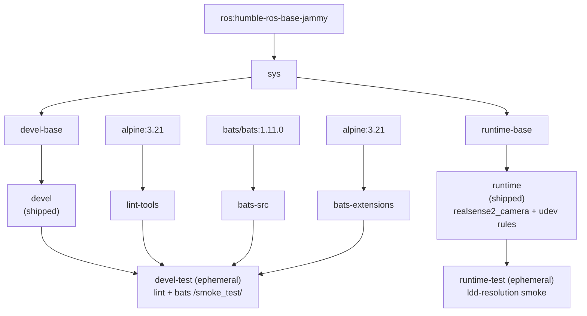

**[English](../README.md)** | **[繁體中文](README.zh-TW.md)** | **[简体中文](README.zh-CN.md)** | **[日本語](README.ja.md)**

# Intel RealSense Docker 容器（ROS 2）

[](https://github.com/ycpss91255-docker/realsense_ros2/actions/workflows/main.yaml) [](../LICENSE)

> **TL;DR** — 容器化的 Intel RealSense ROS 2 驱动程序。通过 apt 安装 `realsense2-camera` 和 `realsense2-description`（两者会以传递依赖方式拉入 `librealsense2`），内含 udev 规则以访问设备。
>
> ```bash
> just build && just run
> ```

## 目录

- [概述](#概述)
- [功能特性](#功能特性)
- [快速开始](#快速开始)
- [使用方式](#使用方式)
- [配置](#配置)
- [架构](#架构)
- [Smoke Tests](#smoke-tests)
- [目录结构](#目录结构)

---

## 概述

为 Intel RealSense 深度相机提供可复现的 ROS 2 环境。容器从 ROS 2 apt 软件源安装 `ros-humble-realsense2-camera` 和 `ros-humble-realsense2-description` 软件包（`librealsense2` 库会作为其依赖以传递方式拉入），并将上游 udev 规则烤入镜像，使 USB 设备在容器内以正确的权限挂载。多架构基础镜像支持 x86_64 和 ARM64（树莓派、Jetson CPU 模式）。

## 功能特性

- **Apt 安装**：从 ROS 2 apt 软件源安装 `realsense2-camera` 和 `realsense2-description`（`librealsense2` 以传递依赖方式拉入）
- **Smoke Test**：Bats 测试在构建时自动执行，验证环境正确性
- **Docker Compose**：单一 `compose.yaml` 管理所有目标
- **udev 规则**：预配置 RealSense USB 设备访问权限
- **多架构支持**：支持 x86_64 和 ARM64（RPi、Jetson CPU 模式）

## 快速开始

```bash
# 1. 构建
just build

# 2. 运行（默认：ros2 launch realsense2_camera rs_launch.py）
just run

# 或直接使用 docker compose
docker compose up runtime
docker compose down
```

## 使用方式

### 运行环境

用户入口是 `just`（仓库根目录的 `justfile` 符号链接到 base subtree）。
各 recipe 以 1:1 方式转发到 `script/` 下的 wrapper 脚本，并完整透传参数 ——
无需 `--` 分隔符。

```bash
just build                       # 构建（默认：devel）
just build test                  # 构建 devel-test 关卡
just run                         # 启动（例如 just run -d）
just exec                        # 进入运行中的容器
just stop                        # 停止并移除容器
just setup                       # 从 setup.conf 重新生成 .env + compose.yaml

docker compose build runtime     # 等效的底层命令
docker compose up runtime        # 启动
docker compose exec runtime bash # 进入运行中的容器
```

### Smoke tests（test 阶段）

Smoke tests 在构建时自动执行；测试失败则构建失败。`devel-test` 阶段运行
lint（ShellCheck + Hadolint）以及 bats 测试套件，`runtime-test` 阶段对已安装的
`realsense2_camera` 库运行 ldd 解析检查。

```bash
just build test
# 或
docker compose --profile test build test
```

## 配置

### 配置面（setup.conf）

真正的配置面是 `config/docker/setup.conf`。`just setup` 会据此生成 `.env` 和
`compose.yaml`，因此 `.env` 是生成产物，不应手动编辑。请编辑 `setup.conf`
（或 `just setup-tui`）后重新运行 `just setup`。

`setup.conf` 划分为若干区段 —— `[image]`、`[build]`、`[deploy]`、`[gui]`、
`[network]`、`[security]`、`[resources]`、`[environment]`、`[tmpfs]`、
`[devices]`、`[volumes]`。例如 `[deploy]` 区段承载 GPU 运行时键
（`gpu_mode`、`gpu_count`、`gpu_capabilities`、`gpu_runtime`），而 `[image]`
依据命名规则推导镜像名称，而非使用字面的 `image_name` 键。

### RealSense udev 规则

udev 规则必须装在 **host**，而不仅仅是容器内。容器没有 `udevd`，而设备节点的权限
位于通过 `/dev` bind mount 共享的 host `devtmpfs` inode 上，所以镜像内置的那份规则
本身不会生效。缺少 host 规则，容器内的非 root 用户就无法打开 raw USB 节点，SDK 会
误判相机（报告 USB 2.0、`Product Line not supported`，或固件更新失败）。详见
[IntelRealSense/librealsense#12022](https://github.com/IntelRealSense/librealsense/issues/12022)。

用内附脚本在 host 上安装一次即可（会使用 `sudo`）：

```bash
./script/install_udev_rules.sh
```

脚本会把 `config/realsense/99-realsense-libusb.rules` 复制到 `/etc/udev/rules.d/`
并重新加载 udev，之后请重新插拔相机。容器本身以 `privileged` 模式运行并挂载 `/dev`。

## 架构

### Docker 构建阶段图



### 阶段说明

| 阶段 | FROM | 用途 |
|------|------|------|
| `bats-src` | `bats/bats:1.11.0` | Bats 可执行文件来源，不出货 |
| `bats-extensions` | `alpine:3.21` | bats-support、bats-assert，不出货 |
| `lint-tools` | `alpine:3.21` | ShellCheck + Hadolint，不出货 |
| `sys` | `ros:humble-ros-base-jammy` | 公共基础：用户、locale、时区（base v0.41.0 构建契约） |
| `devel-base` | `sys` | 开发工具 + RealSense 软件包 + Dynamic Calibration Tool（amd64） |
| `devel` | `devel-base` | 出货的开发镜像（默认 CMD `bash`） |
| `devel-test` | `devel` | Lint + smoke tests，构建后丢弃（临时性） |
| `runtime-base` | `sys` | 精简基础（`sudo`、`tini`） |
| `runtime` | `runtime-base` | 出货的运行时镜像：RealSense 软件包 + udev 规则（默认 CMD `ros2 launch realsense2_camera rs_launch.py`） |
| `runtime-test` | `runtime` | 对 `realsense2_camera` 库的 ldd 解析 smoke，构建后丢弃（临时性） |

## Smoke Tests

构建期自动测试详见 [TEST.md](test/TEST.md)；实机相机测试见 [CAMERA.md](CAMERA.md)；动态校正工具见 [CALIBRATION.md](CALIBRATION.md)。

## 目录结构

```text
realsense_ros2/
├── Dockerfile                   # 多阶段构建
├── LICENSE
├── README.md
├── justfile -> .base/script/docker/justfile        # 符号链接（用户入口）
├── .hadolint.yaml -> .base/.hadolint.yaml          # 符号链接
├── .base/                       # base subtree（只读；v0.41.0）
├── script/
│   ├── entrypoint.sh            # 容器入口点（仓库自有）
│   ├── install_udev_rules.sh    # 在 host 安装 RealSense udev 规则（仓库自有）
│   ├── build.sh -> ../.base/script/docker/wrapper/build.sh   # 符号链接
│   ├── run.sh   -> ../.base/script/docker/wrapper/run.sh     # 符号链接
│   ├── exec.sh  -> ../.base/script/docker/wrapper/exec.sh    # 符号链接
│   ├── stop.sh  -> ../.base/script/docker/wrapper/stop.sh    # 符号链接
│   ├── prune.sh -> ../.base/script/docker/wrapper/prune.sh   # 符号链接
│   ├── setup.sh -> ../.base/script/docker/wrapper/setup.sh   # 符号链接
│   ├── setup_tui.sh -> ../.base/script/docker/wrapper/setup_tui.sh  # 符号链接
│   └── hooks/                   # pre/ + post/ wrapper hooks
├── config/
│   ├── docker/
│   │   └── setup.conf           # 配置面（.env/compose.yaml 由此生成）
│   └── realsense/
│       └── 99-realsense-libusb.rules  # RealSense udev 规则
├── doc/
│   ├── README.zh-TW.md          # 繁体中文
│   ├── README.zh-CN.md          # 简体中文
│   ├── README.ja.md             # 日文
│   ├── adr/                     # 架构决策记录（ADR）
│   ├── CAMERA.md               # 实机相机手动测试
│   ├── CALIBRATION.md          # 动态校正工具说明
│   ├── changelog/CHANGELOG.md
│   └── test/
│       └── TEST.md             # 构建期自动 smoke 测试
├── .github/workflows/
│   └── main.yaml                # CI（调用 base 可复用的 build/release worker）
└── test/
    └── smoke/                   # 仓库自有的 bats 测试
        └── ros_env.bats         # （helper 及更多 .bats 来自 .base/test/smoke/）
```
