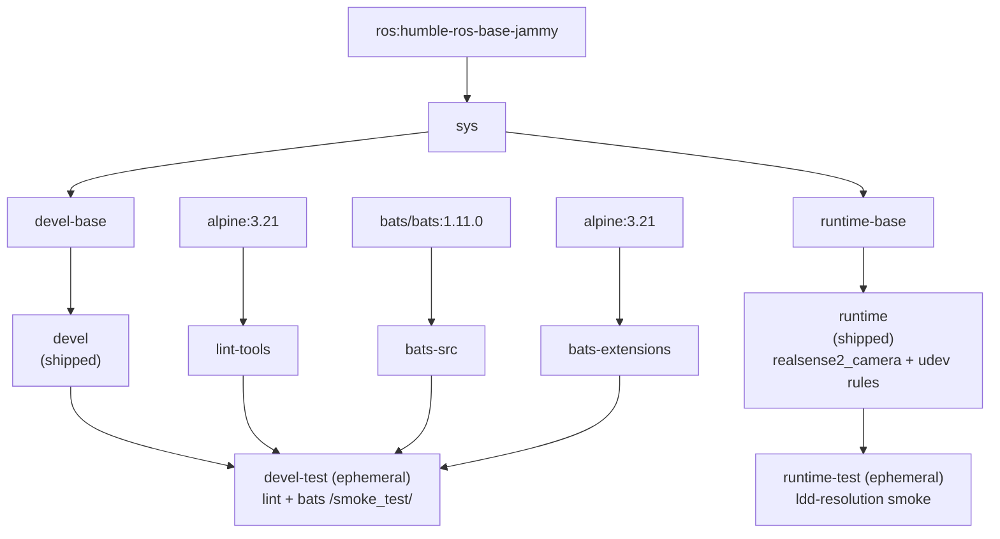

**[English](../README.md)** | **[繁體中文](README.zh-TW.md)** | **[简体中文](README.zh-CN.md)** | **[日本語](README.ja.md)**

# Intel RealSense Docker 容器（ROS 2）

[](https://github.com/ycpss91255-docker/realsense_ros2/actions/workflows/main.yaml) [](../LICENSE)

## TL;DR

容器化的 Intel RealSense ROS 2 驅動程式。透過 apt 安裝 `realsense2-camera` 和 `realsense2-description`（兩者會以相依關係連帶拉入 `librealsense2`），內含 udev 規則以存取裝置。

```bash
just build && just run
```

---

## 目錄

- [概觀](#概觀)
- [功能特色](#功能特色)
- [快速開始](#快速開始)
- [使用方式](#使用方式)
- [設定](#設定)
- [架構](#架構)
- [Smoke Tests](#smoke-tests)
- [目錄結構](#目錄結構)

---

## 概觀

提供可重現的 ROS 2 環境，供 Intel RealSense 深度相機使用。容器會從 ROS 2 apt 套件庫安裝 `ros-humble-realsense2-camera` 與 `ros-humble-realsense2-description` 套件（`librealsense2` 函式庫會以相依關係連帶拉入），並內建上游 udev 規則，讓 USB 裝置在容器內以正確的權限掛載。多架構基底映像支援 x86_64 與 ARM64（Raspberry Pi、Jetson CPU 模式）。

## 功能特色

- **Apt 安裝**：從 ROS 2 apt 套件庫安裝 `realsense2-camera` 和 `realsense2-description`（`librealsense2` 以相依關係連帶拉入）
- **Smoke Test**：Bats 測試在建置時自動執行，驗證環境正確性
- **Docker Compose**：單一 `compose.yaml` 管理所有目標
- **udev 規則**：預先設定 RealSense USB 裝置存取權限
- **多架構支援**：支援 x86_64 和 ARM64（RPi、Jetson CPU 模式）

## 快速開始

```bash
# 1. 建置
just build

# 2. 執行（預設：ros2 launch realsense2_camera rs_launch.py）
just run

# 或直接使用 docker compose
docker compose up runtime
docker compose down
```

## 使用方式

### 執行環境

使用者進入點是 `just`（repo 根目錄的 `justfile` 以 symlink 連到 base
subtree）。各 recipe 會 1:1 轉發到 `script/` 底下的 wrapper 腳本，並完整
傳遞參數 -- 不需要 `--` 分隔符。

```bash
just build                       # 建置（預設：devel）
just build test                  # 建置 devel-test 關卡
just run                         # 啟動（例如 just run -d）
just exec                        # 進入執行中的容器
just stop                        # 停止並移除容器
just setup                       # 從 setup.conf 重新產生 .env + compose.yaml

docker compose build runtime     # 等效的低階指令
docker compose up runtime        # 啟動
docker compose exec runtime bash # 進入執行中的容器
```

### Smoke tests（test 階段）

Smoke tests 在建置時自動執行；測試失敗則建置失敗。`devel-test` 階段執行
lint（ShellCheck + Hadolint）以及 bats 測試套件，`runtime-test` 階段則對
已安裝的 `realsense2_camera` 函式庫執行 ldd 解析檢查。

```bash
just build test
# 或
docker compose --profile test build test
```

## 設定

### 設定介面（setup.conf）

真正的設定介面是 `config/docker/setup.conf`。`just setup` 會從它產生 `.env`
與 `compose.yaml`，因此 `.env` 是產生出來的產物，不應手動編輯。請編輯
`setup.conf`（或執行 `just setup-tui`）後重新執行 `just setup`。

`setup.conf` 以區段組織 -- `[image]`、`[build]`、`[deploy]`、`[gui]`、
`[network]`、`[security]`、`[resources]`、`[environment]`、`[tmpfs]`、
`[devices]`、`[volumes]`。例如 `[deploy]` 區段帶有 GPU runtime 鍵
（`gpu_mode`、`gpu_count`、`gpu_capabilities`、`gpu_runtime`），而 `[image]`
則依命名規則推導映像名稱，而非使用字面的 `image_name` 鍵。

### RealSense udev 規則

容器包含位於 `/etc/udev/rules.d/99-realsense-libusb.rules` 的 udev 規則，用於 RealSense USB 裝置存取。容器以 `privileged` 模式執行，並掛載 `/dev`。

## 架構

### Docker 建置階段圖



### 階段說明

| 階段 | FROM | 用途 |
|------|------|------|
| `bats-src` | `bats/bats:1.11.0` | Bats 執行檔來源，不出貨 |
| `bats-extensions` | `alpine:3.21` | bats-support、bats-assert，不出貨 |
| `lint-tools` | `alpine:3.21` | ShellCheck + Hadolint，不出貨 |
| `sys` | `ros:humble-ros-base-jammy` | 共用基底：使用者、locale、時區（base v0.41.0 build contract） |
| `devel-base` | `sys` | 開發工具 + RealSense 套件 |
| `devel` | `devel-base` | 出貨的開發映像（預設 CMD `bash`） |
| `devel-test` | `devel` | Lint + smoke tests，建置後丟棄（暫時性） |
| `runtime-base` | `sys` | 最小基底（`sudo`、`tini`） |
| `runtime` | `runtime-base` | 出貨的 runtime 映像：RealSense 套件 + udev 規則（預設 CMD `ros2 launch realsense2_camera rs_launch.py`） |
| `runtime-test` | `runtime` | 對 `realsense2_camera` 函式庫執行 ldd 解析 smoke，建置後丟棄（暫時性） |

## Smoke Tests

建置期自動測試詳見 [TEST.md](test/TEST.md)；實機相機測試見 [CAMERA.md](test/CAMERA.md)。

## 目錄結構

```text
realsense_ros2/
├── Dockerfile                   # 多階段建置
├── LICENSE
├── README.md
├── justfile -> .base/script/docker/justfile        # symlink（使用者進入點）
├── .hadolint.yaml -> .base/.hadolint.yaml          # symlink
├── .base/                       # base subtree（唯讀；v0.41.0）
├── script/
│   ├── entrypoint.sh            # 容器進入點（repo 自有）
│   ├── build.sh -> ../.base/script/docker/wrapper/build.sh   # symlink
│   ├── run.sh   -> ../.base/script/docker/wrapper/run.sh     # symlink
│   ├── exec.sh  -> ../.base/script/docker/wrapper/exec.sh    # symlink
│   ├── stop.sh  -> ../.base/script/docker/wrapper/stop.sh    # symlink
│   ├── prune.sh -> ../.base/script/docker/wrapper/prune.sh   # symlink
│   ├── setup.sh -> ../.base/script/docker/wrapper/setup.sh   # symlink
│   ├── setup_tui.sh -> ../.base/script/docker/wrapper/setup_tui.sh  # symlink
│   └── hooks/                   # pre/ + post/ wrapper hooks
├── config/
│   ├── docker/
│   │   └── setup.conf           # 設定介面（.env/compose.yaml 由此產生）
│   └── realsense/
│       └── 99-realsense-libusb.rules  # RealSense udev 規則
├── doc/
│   ├── README.zh-TW.md          # 繁體中文
│   ├── README.zh-CN.md          # 簡體中文
│   ├── README.ja.md             # 日文
│   ├── changelog/CHANGELOG.md
│   └── test/
│       ├── TEST.md             # 建置期自動 smoke 測試
│       └── CAMERA.md           # 實機相機手動測試
├── .github/workflows/
│   └── main.yaml                # CI（呼叫 base 的 reusable build/release worker）
└── test/
    └── smoke/                   # repo 自有的 bats 測試
        └── ros_env.bats         # （helper 與更多 .bats 來自 .base/test/smoke/）
```
