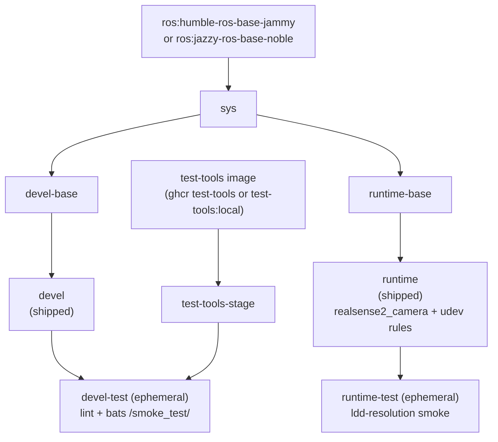

**[English](../README.md)** | **[繁體中文](README.zh-TW.md)** | **[简体中文](README.zh-CN.md)** | **[日本語](README.ja.md)**

# Intel RealSense Docker 容器（ROS 2）

[](https://github.com/ycpss91255-docker/realsense_ros2/actions/workflows/main.yaml) [](../LICENSE)

## TL;DR

容器化的 Intel RealSense ROS 2 相機 **app**：`runtime` 映像的預設指令會 launch 相機節點，並發布即時 **RGB + Depth** topic。透過 apt 安裝 `realsense2-camera` / `realsense2-description`（連帶拉入 `librealsense2`），並內含供 USB 存取的 udev 規則。多發行版（Humble + Jazzy）、多架構（x86_64 + ARM64 / Raspberry Pi）。

```bash
./script/install_udev_rules.sh      # once on the host (physical camera)
just build && just run -t runtime    # build + launch the camera app
# -> logs show "RealSense Node Is Up!" and depth/color streaming
```

> `just run` 自己只會開 **devel** 開發 shell，不是相機 app -- 要用 `just run -t runtime`。請見 [快速開始](#快速開始)觀看 RGB-D 串流。

---

## 目錄

- [概觀](#概觀)
- [功能特色](#功能特色)
- [前置需求](#prerequisites)
- [快速開始](#快速開始)
- [使用方式](#使用方式)
- [解除安裝 / 清理](#uninstall--cleanup)
- [設定](#設定)
- [架構](#架構)
- [Smoke Tests](#smoke-tests)
- [目錄結構](#目錄結構)

---

## 概觀

提供可重現的 ROS 2 環境，供 Intel RealSense 深度相機使用。CI 會同時為 **ROS 2 Humble（Ubuntu 22.04）與 Jazzy（Ubuntu 24.04）** 建置映像；各版本會從 ROS 2 apt 套件庫安裝對應的 `ros-<distro>-realsense2-camera` 與 `ros-<distro>-realsense2-description` 套件（`librealsense2` 函式庫會以相依關係連帶拉入），並內建上游 udev 規則，讓 USB 裝置在容器內以正確的權限掛載。多架構基底映像支援 x86_64 與 ARM64（Raspberry Pi、Jetson CPU 模式）。

## 功能特色

- **多發行版**：CI 以單一 Dockerfile 建置 ROS 2 Humble（Ubuntu 22.04）與 Jazzy（Ubuntu 24.04）
- **Apt 安裝**：從 ROS 2 apt 套件庫安裝 `realsense2-camera` 和 `realsense2-description`（`librealsense2` 以相依關係連帶拉入）
- **Smoke Test**：Bats 測試在建置時自動執行，驗證環境正確性
- **Docker Compose**：單一 `compose.yaml` 管理所有目標
- **udev 規則**：預先設定 RealSense USB 裝置存取權限
- **多架構支援**：支援 x86_64 和 ARM64（RPi、Jetson CPU 模式）

## Prerequisites

使用者進入點是 `just`，由它驅動 Docker。請在 host 上先安裝以下工具一次：

- **Docker Engine + Compose plugin。** wrapper 會呼叫 `docker compose`，因此必須
  具備 Compose plugin。官方便利腳本會一併安裝 Engine + Buildx + Compose：

  ```bash
  curl -fsSL https://get.docker.com | sudo sh
  sudo usermod -aG docker "$USER"   # log out/in so docker runs without sudo
  ```

  以 `docker compose version` 驗證。（單裝發行版套件可能會少了 Compose --
  例如只裝 `docker.io` 而沒有 `docker-compose-v2` 時會得到 `docker: unknown command:
  docker compose`。）

- **just**（命令執行器）。將預編譯的 binary 裝到 `~/.local/bin`，免 sudo：

  ```bash
  curl --proto '=https' --tlsv1.2 -sSf https://just.systems/install.sh | bash -s -- --to ~/.local/bin
  ```

  確認 `~/.local/bin` 在 `PATH` 上，然後以 `just --version` 驗證。每個 recipe
  也都有原始 fallback（`./script/<verb>.sh`），若你不想安裝 `just` 也可使用。

- **（實體相機）host udev 規則。** 若要透過 USB 使用真正的 RealSense，請在 host
  上安裝內附的規則（見 [RealSense udev 規則](#realsense-udev-rules)）：

  ```bash
  ./script/install_udev_rules.sh
  ```

  少了它，容器內的非 root 使用者無法開啟 raw USB 節點，SDK 也會誤判相機 --
  例如 USB 3 裝置被列舉成 USB 2.1（「Reduced performance expected」）。

## 快速開始

```bash
# 1. Build (default: ROS 2 Humble)
just build

# 2. (physical camera) install the host udev rules once
./script/install_udev_rules.sh

# 3. Launch the camera app. The `runtime` service's default command is
#    `ros2 launch realsense2_camera rs_launch.py`; foreground shows the node logs:
just run -t runtime
#    ...or detached:
just run -d -t runtime
```

### See the RGB-D data

**CLI** -- 確認 color + depth topic 正在串流（互動式 exec 內有 `ros2`）：

```bash
just exec -t runtime bash -ic 'ros2 topic hz /camera/camera/color/image_raw'
just exec -t runtime bash -ic 'ros2 topic hz /camera/camera/depth/image_rect_raw'
```

**Visual** -- 用 `rqt` 觀看影像串流（`devel` 映像內含 `rqt_image_view`）：

```bash
just run -t devel
# inside the container:
ros2 launch realsense2_camera rs_launch.py &     # start the camera
ros2 run rqt_image_view rqt_image_view           # pick color/image_raw and depth/image_rect_raw
```

> 不帶 `-t` 的 `just run` 會開 **devel** 開發 shell，不是相機 app -- app 要用
> `just run -t runtime`。可透過傳入 launch 參數調整相機，例如
> `just run -t runtime ros2 launch realsense2_camera rs_launch.py pointcloud.enable:=true`，
> 或完全覆寫該指令。低階等價指令見 [使用方式](#使用方式)。

## 使用方式

### 執行環境

使用者進入點是 `just`（repo 根目錄的 `justfile` 以 symlink 連到 base
subtree）。各 recipe 會 1:1 轉發到 `script/` 底下的 wrapper 腳本，並完整
傳遞參數 -- 不需要 `--` 分隔符。

```bash
just build                       # 建置（預設：devel）
just build test                  # 建置 devel-test 關卡
just run                         # 啟動（例如 just run -d）
just exec                        # 進入執行中的容器
just stop                        # 停止並移除容器
just setup                       # 從 setup.conf 重新產生 .env + compose.yaml

docker compose build runtime     # 等效的低階指令
docker compose up runtime        # 啟動
docker compose exec runtime bash # 進入執行中的容器
```

### 選擇 ROS 2 發行版

`just build` 使用 Dockerfile 的預設值（Humble / Ubuntu 22.04 jammy）。CI 會透過
`.github/workflows/main.yaml` 中的 `call-docker-build` matrix 自動建置 Humble 與
Jazzy 兩個版本。若要在本機建置 Jazzy，請透過 `docker compose` 傳入對應的
build-arg：

```bash
docker compose build \
  --build-arg ROS_DISTRO=jazzy \
  --build-arg ROS_TAG=ros-base \
  --build-arg UBUNTU_CODENAME=noble \
  runtime
```

### Smoke tests（test 階段）

Smoke tests 在建置時自動執行；測試失敗則建置失敗。`devel-test` 階段執行
lint（ShellCheck + Hadolint）以及 bats 測試套件，`runtime-test` 階段則對
已安裝的 `realsense2_camera` 函式庫執行 ldd 解析檢查。

```bash
just build test
# 或
docker compose --profile test build test
```

## Uninstall / Cleanup

```bash
just stop      # stop and remove the running containers
just prune     # remove this repo's images + dangling build cache (see `just prune -h`)
```

要徹底移除 repo 放在 host 上的東西：

- **映像 / build cache：** `just prune`（或對特定映像用 `docker image rm <tag>`）。
- **host udev 規則**（僅在你安裝過時）：

  ```bash
  sudo rm -f /etc/udev/rules.d/99-realsense-libusb.rules
  sudo udevadm control --reload-rules && sudo udevadm trigger
  ```

- **repo 本身：** 刪除 clone 下來的目錄。

## 設定

### 設定介面（setup.conf）

真正的設定介面是 `config/docker/setup.conf`。`just setup` 會從它產生 `.env`
與 `compose.yaml`，因此 `.env` 是產生出來的產物，不應手動編輯。請編輯
`setup.conf`（或執行 `just setup-tui`）後重新執行 `just setup`。

`setup.conf` 以區段組織 -- `[image]`、`[build]`、`[deploy]`、`[gui]`、
`[network]`、`[security]`、`[resources]`、`[environment]`、`[tmpfs]`、
`[devices]`、`[volumes]`。例如 `[deploy]` 區段帶有 GPU runtime 鍵
（`gpu_mode`、`gpu_count`、`gpu_capabilities`、`gpu_runtime`），而 `[image]`
則依命名規則推導映像名稱，而非使用字面的 `image_name` 鍵。

### RealSense udev 規則

udev 規則必須裝在 **host**，而不只是容器內。容器沒有 `udevd`，而裝置節點的權限
位於透過 `/dev` bind mount 共享的 host `devtmpfs` inode 上，所以映像內建的那份規則
本身不會生效。少了 host 規則，容器內的非 root 使用者就無法開啟 raw USB 節點，SDK 會
誤判相機（回報 USB 2.0、`Product Line not supported`，或韌體更新失敗）。詳見
[IntelRealSense/librealsense#12022](https://github.com/IntelRealSense/librealsense/issues/12022)。

用內附腳本在 host 上安裝一次即可（會使用 `sudo`）：

```bash
./script/install_udev_rules.sh
```

腳本會把 `config/realsense/99-realsense-libusb.rules` 複製到 `/etc/udev/rules.d/`
並重新載入 udev，之後請重新插拔相機。容器本身以 `privileged` 模式執行並掛載 `/dev`。

## 架構

### Docker 建置階段圖



### 階段說明

| 階段 | FROM | 用途 |
|------|------|------|
| `test-tools-stage` | `${TEST_TOOLS_IMAGE}`（multi-arch ghcr test-tools，或 `test-tools:local`） | ShellCheck + Hadolint + Bats，不出貨 |
| `sys` | `ros:<distro>-ros-base-<codename>`（humble-jammy / jazzy-noble） | 共用基底：使用者、locale、時區（base v0.41.0 build contract） |
| `devel-base` | `sys` | 開發工具 + ROS 2 desktop + RealSense 套件 + Dynamic Calibration Tool（amd64） |
| `devel` | `devel-base` | 出貨的開發映像（預設 CMD `bash`） |
| `devel-test` | `devel` + `test-tools-stage` | Lint + smoke tests，建置後丟棄（暫時性） |
| `runtime-base` | `sys` | 最小基底（`sudo`、`tini`） |
| `runtime` | `runtime-base` | 出貨的 runtime 映像：RealSense 套件 + udev 規則（預設 CMD `ros2 launch realsense2_camera rs_launch.py`） |
| `runtime-test` | `runtime` | 對 `realsense2_camera` 函式庫執行 ldd 解析 smoke，建置後丟棄（暫時性） |

## Smoke Tests

建置期自動測試詳見 [TEST.md](test/TEST.md)；實機相機測試見 [CAMERA.md](CAMERA.md)；動態校正工具見 [CALIBRATION.md](CALIBRATION.md)。

## 目錄結構

```text
realsense_ros2/
├── Dockerfile                   # 多階段建置
├── LICENSE
├── README.md
├── justfile -> .base/script/docker/justfile        # symlink（使用者進入點）
├── .hadolint.yaml -> .base/.hadolint.yaml          # symlink
├── .base/                       # base subtree（唯讀；v0.41.0）
├── script/
│   ├── entrypoint.sh            # 容器進入點（repo 自有）
│   ├── install_udev_rules.sh    # 在 host 安裝 RealSense udev 規則（repo 自有）
│   ├── build.sh -> ../.base/script/docker/wrapper/build.sh   # symlink
│   ├── run.sh   -> ../.base/script/docker/wrapper/run.sh     # symlink
│   ├── exec.sh  -> ../.base/script/docker/wrapper/exec.sh    # symlink
│   ├── stop.sh  -> ../.base/script/docker/wrapper/stop.sh    # symlink
│   ├── prune.sh -> ../.base/script/docker/wrapper/prune.sh   # symlink
│   ├── setup.sh -> ../.base/script/docker/wrapper/setup.sh   # symlink
│   ├── setup_tui.sh -> ../.base/script/docker/wrapper/setup_tui.sh  # symlink
│   └── hooks/                   # pre/ + post/ wrapper hooks
├── config/
│   ├── docker/
│   │   └── setup.conf           # 設定介面（.env/compose.yaml 由此產生）
│   └── realsense/
│       └── 99-realsense-libusb.rules  # RealSense udev 規則
├── doc/
│   ├── README.zh-TW.md          # 繁體中文
│   ├── README.zh-CN.md          # 簡體中文
│   ├── README.ja.md             # 日文
│   ├── adr/                     # 架構決策記錄（ADR）
│   ├── CAMERA.md               # 實機相機手動測試
│   ├── CALIBRATION.md          # 動態校正工具說明
│   ├── changelog/CHANGELOG.md
│   └── test/
│       └── TEST.md             # 建置期自動 smoke 測試
├── .github/workflows/
│   └── main.yaml                # CI（呼叫 base 的 reusable build/release worker）
└── test/
    └── smoke/                   # repo 自有的 bats 測試
        └── ros_env.bats         # （helper 與更多 .bats 來自 .base/test/smoke/）
```
